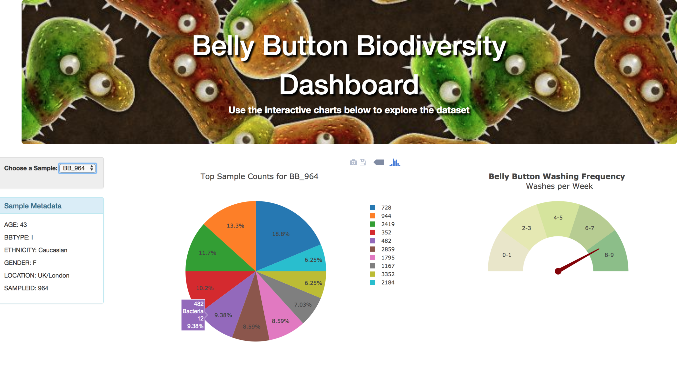

# Interactive Dashboard

For this assignment, I created an interactive dashboard to explore the [Belly Button Biodiversity DataSet](http://robdunnlab.com/projects/belly-button-biodiversity/).

## Objectives

* Flask API to design an API for my dataset and to serve the HTML and JavaScript required for my dashboard.

* Plotly.js to build interactive charts for my dashboard.

* Bootstrap to structure my HTML template

* Python / Pandas to clean, filter and format data before converting to JSON