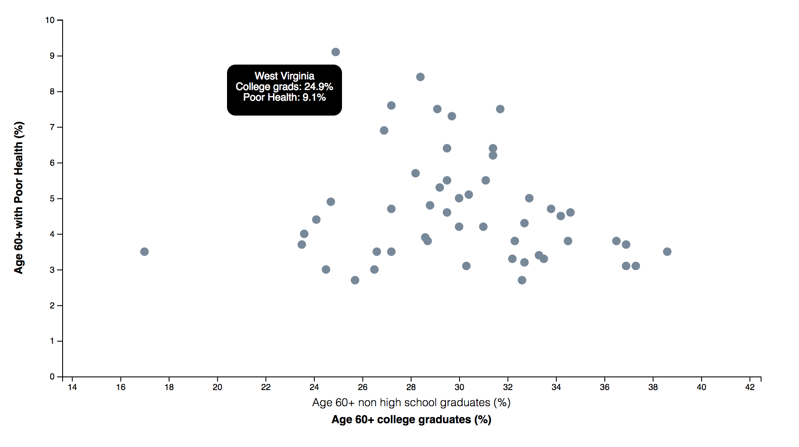

# Unit 16 | Assignment - Data Journalism and D3

## Background

My task for this project was to search the US Census Bureau website to study health and demographics for the year 2014. 
After sorting through many databases, I decided to study "poor health" of the senior citizen demographic for all states. 
I wanted to see if there was a correlation between poor health and education achievement. 
The following charts are my findings:

### 1. Age 60+ Non High School Graduate

This chart shows that there is a positive linear correlation between non high school graduates and poor health. 
West Virgina has the highest percentage of poor health seniors at 9% and approximately 15% of non high school graduates. 
The correlation between education and poor health was approximately .73. 

### 2. Age 60+ College Graduate 

This chart shows that there is negative correlation between college educated seniors and poor health. 
Wyoming has the highest percentage of college graduates and the lowest percentage of poor health seniors.
What's interesting is that West Virgina is an outlier again.  Although West Virgina has 25% college graduate seniors, 
the state also has the highest amount of seniors with poor health. 
I'm curious to know about their eating / active lifestyle habits are in West Virgina. 

- - -

## Copyright

ABF Data (C) 2018. All Rights Reserved.
