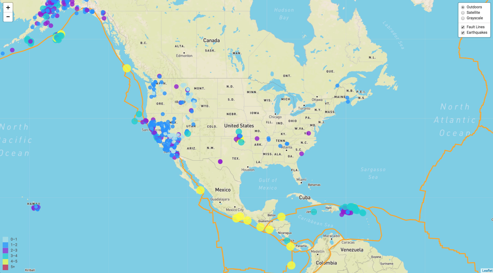
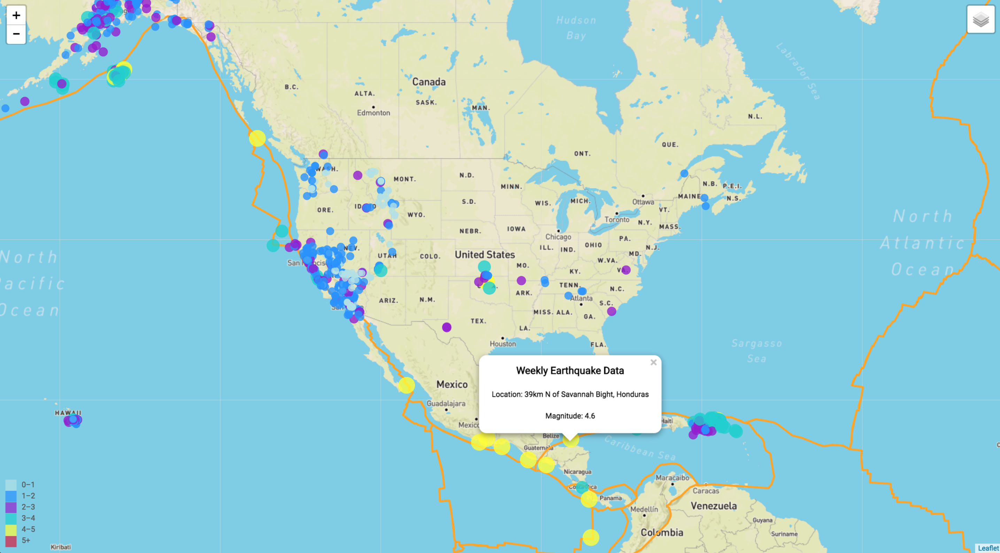
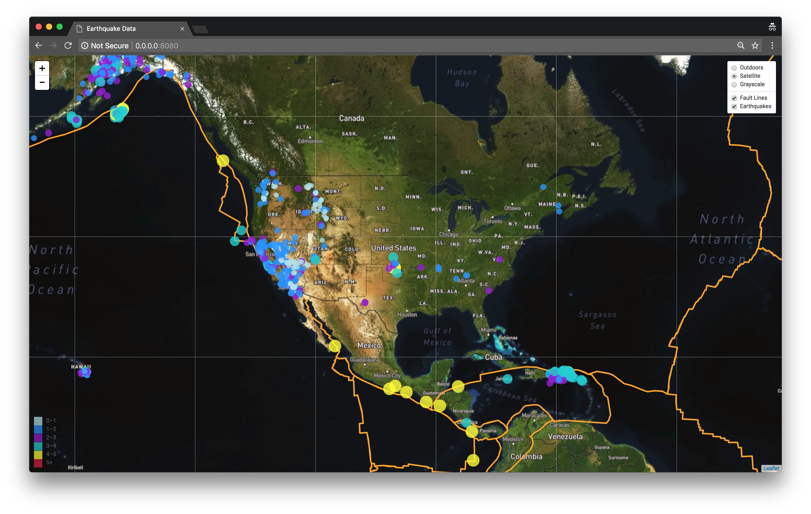
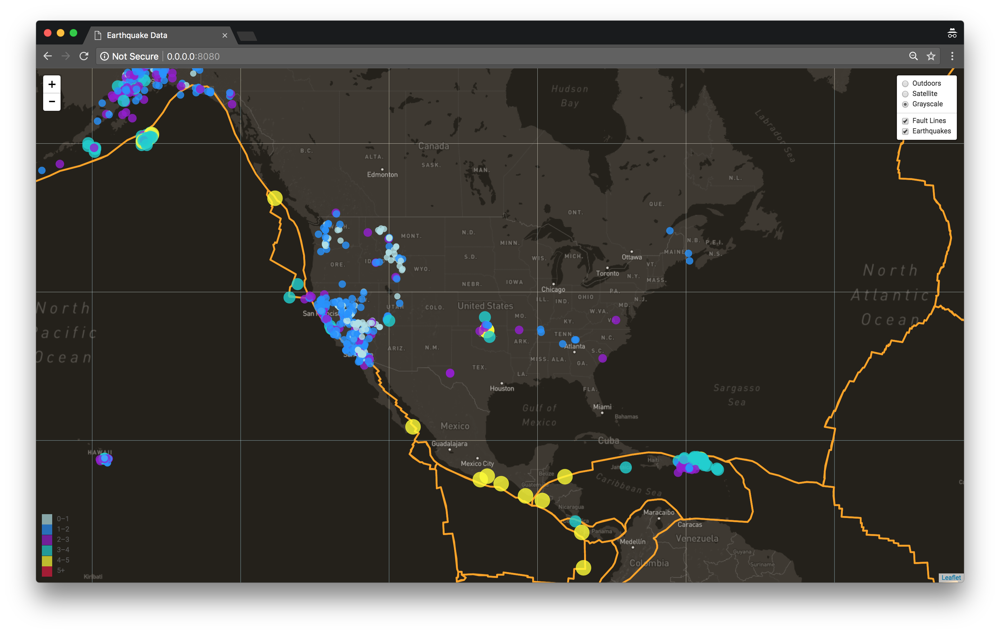

# Unit 17 | Assignment - Visualizing Data with Leaflet

## Background

For this project I referenced the United States Geological Survey to create a dymanic map of Earthquake Data from the past week. The objective was to visualize their data to educate the public and other government organizations.

My map was created by using [Leaflet](http://leafletjs.com/), an open source javascript library for mobile friendly interactive maps. I visited the [USGS GeoJSON Feed](http://earthquake.usgs.gov/earthquakes/feed/v1.0/geojson.php) to obtain the most recent earthquake data which was plotted on my map. 

### Step 1: Basic Visualization

These maps highlight both the tectonic plates and earthquake data for the past week on the basic outdoor overlay.

### Step 2: More Data

These maps include 3 different overlays:
    1. Outdoor
    2. Satellite
    3. Gray

The end user can toggle through the overlays to view different versions of the map. The user can also hide both the earthquake and plate images.

#### Satellite Map

#### Satellite Map with Tectonic Plate Information

#### Grayscale Map

### Step 3: Time Keeps on Ticking