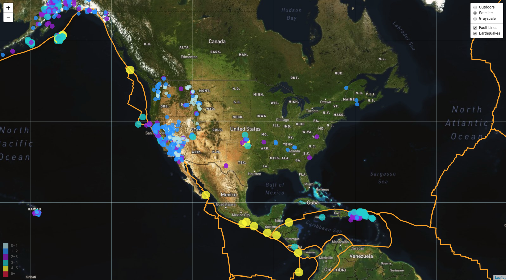
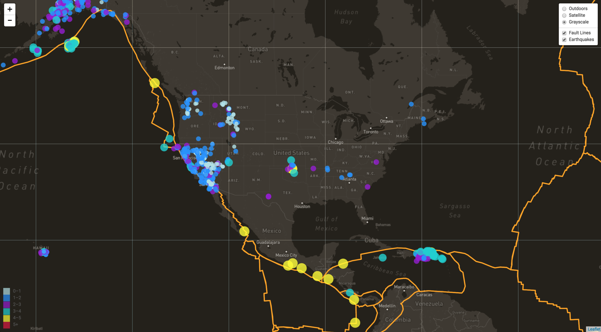

# Unit 17 | Assignment - Visualizing Data with Leaflet

## Background

For this project I referenced the United States Geological Survey to create a dymanic map of Earthquake Data from the past week. The objective was to visualize their data to educate the public and other government organizations.

My map was created by using [Leaflet](http://leafletjs.com/), an open source javascript library for mobile friendly interactive maps. I visited the [USGS GeoJSON Feed](http://earthquake.usgs.gov/earthquakes/feed/v1.0/geojson.php) to obtain the most recent earthquake data which was plotted on my map. 

### Step 1: Basic Visualization

### Step 2: More Data

### Step 3: Time Keeps on Ticking