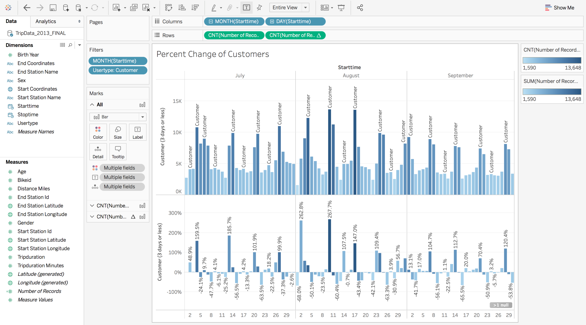

## Unit 1 | Assignment - Citi Bike Analytics

## Background

Since 2013, the Citi Bike Program has implemented a robust infrastructure for collecting data on the program's utilization. Through the team's efforts, each month bike data is collected, organized, and made public on the [Citi Bike Data](https://www.citibikenyc.com/system-data) webpage.

However, while the data has been regularly updated, the team has yet to implement a dashboard or sophisticated reporting process. City officials have a number of questions on the program, so for this assignment your job is to build a set of data reports to provide the answers.

These reports are to made using Python and Tableau. 

## Start Station

## End Station

## Peak Summer Hours

## Percent Change of Customers

## Percent Change of Subscribers

## Copyright

Coding Boot Camp (C) 2018. All Rights Reserved.
