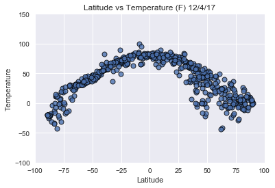
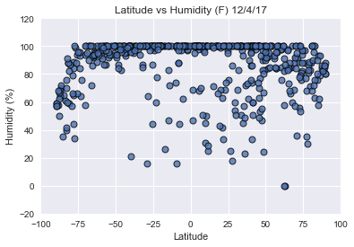
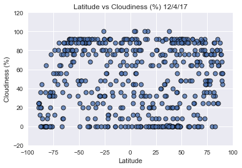
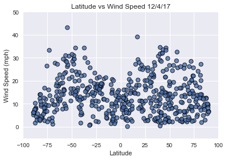

```python
from citipy import citipy
import pandas as pd
import numpy as np
import requests as req
import matplotlib.pyplot as plt
import seaborn as sns
```


```python
# Andy's api key
api_key = "bab6ed8714b504b5454b34baa8e421bb"
```


```python
# Generate random cities by lat,lng (size n = 500)
# List for holding lat_lngs
lat_lngs = []
cities = []
```


```python
# create a set of random lat and lng combinations 
lats = np.random.uniform(low=-90.000, high=90.000, size=1500)
lngs = np.random.uniform(low=-180.000, high=180.000,size=1500)
lat_lngs=zip(lats, lngs)
```


```python
# identify nearest city for each lat, lng combo
for lat_lng in lat_lngs:
    city = citipy.nearest_city(lat_lng[0], lat_lng[1]).city_name
    
    # if city is unique, then add it to our cities list
    if city not in cities:
        cities.append(city)
```


```python
# print city count to confirm sufficient count
len(cities)
```


    627


```python
# create DataFrame for cities
cities_df = pd.DataFrame({'Latitude': lats, 'Longitude': lngs})
```


```python
cities_df.head()
```


<div>
<style>
    .dataframe thead tr:only-child th {
        text-align: right;
    }

    .dataframe thead th {
        text-align: left;
    }

    .dataframe tbody tr th {
        vertical-align: top;
    }
</style>
<table border="1" class="dataframe">
  <thead>
    <tr style="text-align: right;">
      <th></th>
      <th>Latitude</th>
      <th>Longitude</th>
    </tr>
  </thead>
  <tbody>
    <tr>
      <th>0</th>
      <td>40.839784</td>
      <td>94.985041</td>
    </tr>
    <tr>
      <th>1</th>
      <td>-19.643056</td>
      <td>-84.903671</td>
    </tr>
    <tr>
      <th>2</th>
      <td>-61.243176</td>
      <td>10.501139</td>
    </tr>
    <tr>
      <th>3</th>
      <td>81.579187</td>
      <td>-173.536749</td>
    </tr>
    <tr>
      <th>4</th>
      <td>25.875072</td>
      <td>-73.017857</td>
    </tr>
  </tbody>
</table>
</div>


```python
cities_df.shape
```


    (1500, 2)


```python
# randomly select 500 cities (test with 5)
selected_cities = cities_df.sample(n=500)
selected_cities.head()
```


<div>
<style>
    .dataframe thead tr:only-child th {
        text-align: right;
    }

    .dataframe thead th {
        text-align: left;
    }

    .dataframe tbody tr th {
        vertical-align: top;
    }
</style>
<table border="1" class="dataframe">
  <thead>
    <tr style="text-align: right;">
      <th></th>
      <th>Latitude</th>
      <th>Longitude</th>
    </tr>
  </thead>
  <tbody>
    <tr>
      <th>301</th>
      <td>17.584802</td>
      <td>85.358970</td>
    </tr>
    <tr>
      <th>141</th>
      <td>19.764374</td>
      <td>66.540265</td>
    </tr>
    <tr>
      <th>1455</th>
      <td>-81.894977</td>
      <td>-143.816811</td>
    </tr>
    <tr>
      <th>140</th>
      <td>51.011618</td>
      <td>-32.556042</td>
    </tr>
    <tr>
      <th>830</th>
      <td>17.673500</td>
      <td>115.897267</td>
    </tr>
  </tbody>
</table>
</div>


```python
selected_cities["Temperature"] = ""
selected_cities["Humidity %"] = ""
selected_cities["Wind Speed"] = ""
selected_cities["Cloudiness %"]= ""
selected_cities.head()
```


<div>
<style>
    .dataframe thead tr:only-child th {
        text-align: right;
    }

    .dataframe thead th {
        text-align: left;
    }

    .dataframe tbody tr th {
        vertical-align: top;
    }
</style>
<table border="1" class="dataframe">
  <thead>
    <tr style="text-align: right;">
      <th></th>
      <th>Latitude</th>
      <th>Longitude</th>
      <th>Temperature</th>
      <th>Humidity %</th>
      <th>Wind Speed</th>
      <th>Cloudiness %</th>
    </tr>
  </thead>
  <tbody>
    <tr>
      <th>301</th>
      <td>17.584802</td>
      <td>85.358970</td>
      <td></td>
      <td></td>
      <td></td>
      <td></td>
    </tr>
    <tr>
      <th>141</th>
      <td>19.764374</td>
      <td>66.540265</td>
      <td></td>
      <td></td>
      <td></td>
      <td></td>
    </tr>
    <tr>
      <th>1455</th>
      <td>-81.894977</td>
      <td>-143.816811</td>
      <td></td>
      <td></td>
      <td></td>
      <td></td>
    </tr>
    <tr>
      <th>140</th>
      <td>51.011618</td>
      <td>-32.556042</td>
      <td></td>
      <td></td>
      <td></td>
      <td></td>
    </tr>
    <tr>
      <th>830</th>
      <td>17.673500</td>
      <td>115.897267</td>
      <td></td>
      <td></td>
      <td></td>
      <td></td>
    </tr>
  </tbody>
</table>
</div>


```python
# counter 
row_count = 0

for index, row in selected_cities.iterrows():
    # Create endpoint URL
    
    lat = row["Latitude"]
    lng = row["Longitude"]
    target_url = "http://api.openweathermap.org/data/2.5/weather?lat={}&lon={}&units=IMPERIAL&mode=json&APPID={}".format(lat, lng,api_key)
    # print log to ensure loop is working correctly
    print("Now retrieving city # " + str(row_count))
    print(target_url)
    row_count +=1
    
    # run requests to grab JSON at the requested URL
    requests = req.get(target_url).json()
    
    # append the lat/lng to appropiate columns
    # use try / except to skip any cities
    
    try:
        selected_cities.set_value(index, "Temperature", requests["main"]["temp"])
        selected_cities.set_value(index, "Humidity %", requests["main"]["humidity"])
        selected_cities.set_value(index, "Wind Speed", requests["wind"]["speed"])
        selected_cities.set_value(index, "Cloudiness %", requests["clouds"]["all"])
        
        print("--", end="")
    
    except:
        print(" Missing field... skipping.")

selected_cities.head()
```

    Now retrieving city # 0
    http://api.openweathermap.org/data/2.5/weather?lat=17.584802196128734&lon=85.3589698864937&units=IMPERIAL&mode=json&APPID=bab6ed8714b504b5454b34baa8e421bb
    --Now retrieving city # 1
    http://api.openweathermap.org/data/2.5/weather?lat=19.76437418005446&lon=66.54026485535644&units=IMPERIAL&mode=json&APPID=bab6ed8714b504b5454b34baa8e421bb
    --Now retrieving city # 2
    http://api.openweathermap.org/data/2.5/weather?lat=-81.89497690509174&lon=-143.81681139776794&units=IMPERIAL&mode=json&APPID=bab6ed8714b504b5454b34baa8e421bb
    --Now retrieving city # 3
    http://api.openweathermap.org/data/2.5/weather?lat=51.01161805554028&lon=-32.55604156896783&units=IMPERIAL&mode=json&APPID=bab6ed8714b504b5454b34baa8e421bb
    --Now retrieving city # 4
    http://api.openweathermap.org/data/2.5/weather?lat=17.673500266229&lon=115.89726742483197&units=IMPERIAL&mode=json&APPID=bab6ed8714b504b5454b34baa8e421bb
    --Now retrieving city # 5
    http://api.openweathermap.org/data/2.5/weather?lat=-88.56160589825548&lon=39.59758881442639&units=IMPERIAL&mode=json&APPID=bab6ed8714b504b5454b34baa8e421bb
    --Now retrieving city # 6
    http://api.openweathermap.org/data/2.5/weather?lat=47.86501874977483&lon=-151.23900061774748&units=IMPERIAL&mode=json&APPID=bab6ed8714b504b5454b34baa8e421bb
    --Now retrieving city # 7
    http://api.openweathermap.org/data/2.5/weather?lat=-36.93762982189109&lon=-33.092709956359585&units=IMPERIAL&mode=json&APPID=bab6ed8714b504b5454b34baa8e421bb
    --Now retrieving city # 8
    http://api.openweathermap.org/data/2.5/weather?lat=51.67177831655658&lon=82.40069925651193&units=IMPERIAL&mode=json&APPID=bab6ed8714b504b5454b34baa8e421bb
    --Now retrieving city # 9
    http://api.openweathermap.org/data/2.5/weather?lat=72.25932082187694&lon=66.41135558722613&units=IMPERIAL&mode=json&APPID=bab6ed8714b504b5454b34baa8e421bb
    --Now retrieving city # 10
    http://api.openweathermap.org/data/2.5/weather?lat=6.406642019062261&lon=83.27584316403232&units=IMPERIAL&mode=json&APPID=bab6ed8714b504b5454b34baa8e421bb
    --Now retrieving city # 11
    http://api.openweathermap.org/data/2.5/weather?lat=47.69518866709788&lon=-140.87247247489182&units=IMPERIAL&mode=json&APPID=bab6ed8714b504b5454b34baa8e421bb
    --Now retrieving city # 12
    http://api.openweathermap.org/data/2.5/weather?lat=4.659908688562226&lon=-127.69746607661926&units=IMPERIAL&mode=json&APPID=bab6ed8714b504b5454b34baa8e421bb
    --Now retrieving city # 13
    http://api.openweathermap.org/data/2.5/weather?lat=65.25879118425664&lon=20.301322671662803&units=IMPERIAL&mode=json&APPID=bab6ed8714b504b5454b34baa8e421bb
    --Now retrieving city # 14
    http://api.openweathermap.org/data/2.5/weather?lat=70.749834274569&lon=-115.26227736776019&units=IMPERIAL&mode=json&APPID=bab6ed8714b504b5454b34baa8e421bb
    --Now retrieving city # 15
    http://api.openweathermap.org/data/2.5/weather?lat=-76.76101094507288&lon=-35.52787254218336&units=IMPERIAL&mode=json&APPID=bab6ed8714b504b5454b34baa8e421bb
    --Now retrieving city # 16
    http://api.openweathermap.org/data/2.5/weather?lat=-9.11103068970553&lon=-19.023050072419068&units=IMPERIAL&mode=json&APPID=bab6ed8714b504b5454b34baa8e421bb
    --Now retrieving city # 17
    http://api.openweathermap.org/data/2.5/weather?lat=-77.87426102698743&lon=-19.3804765159839&units=IMPERIAL&mode=json&APPID=bab6ed8714b504b5454b34baa8e421bb
    --Now retrieving city # 18
    http://api.openweathermap.org/data/2.5/weather?lat=-24.690809630842793&lon=-89.78068820438&units=IMPERIAL&mode=json&APPID=bab6ed8714b504b5454b34baa8e421bb
    --Now retrieving city # 19
    http://api.openweathermap.org/data/2.5/weather?lat=10.082430981081032&lon=-100.6531510236535&units=IMPERIAL&mode=json&APPID=bab6ed8714b504b5454b34baa8e421bb
    --Now retrieving city # 20
    http://api.openweathermap.org/data/2.5/weather?lat=67.91897963791354&lon=-56.84707170146967&units=IMPERIAL&mode=json&APPID=bab6ed8714b504b5454b34baa8e421bb
    --Now retrieving city # 21
    http://api.openweathermap.org/data/2.5/weather?lat=-24.497422551274923&lon=-25.827469700196986&units=IMPERIAL&mode=json&APPID=bab6ed8714b504b5454b34baa8e421bb
    --Now retrieving city # 22
    http://api.openweathermap.org/data/2.5/weather?lat=41.16988331512292&lon=76.17395429805185&units=IMPERIAL&mode=json&APPID=bab6ed8714b504b5454b34baa8e421bb
    --Now retrieving city # 23
    http://api.openweathermap.org/data/2.5/weather?lat=36.440160787021995&lon=106.23764963562456&units=IMPERIAL&mode=json&APPID=bab6ed8714b504b5454b34baa8e421bb
    --Now retrieving city # 24
    http://api.openweathermap.org/data/2.5/weather?lat=72.61360788244994&lon=49.64537170815592&units=IMPERIAL&mode=json&APPID=bab6ed8714b504b5454b34baa8e421bb
    --Now retrieving city # 25
    http://api.openweathermap.org/data/2.5/weather?lat=-5.6198872797930335&lon=116.28471743605763&units=IMPERIAL&mode=json&APPID=bab6ed8714b504b5454b34baa8e421bb
    --Now retrieving city # 26
    http://api.openweathermap.org/data/2.5/weather?lat=-83.21501776666585&lon=-20.6334127557098&units=IMPERIAL&mode=json&APPID=bab6ed8714b504b5454b34baa8e421bb
    --Now retrieving city # 27
    http://api.openweathermap.org/data/2.5/weather?lat=69.78890207043258&lon=-144.41008598019098&units=IMPERIAL&mode=json&APPID=bab6ed8714b504b5454b34baa8e421bb
    --Now retrieving city # 28
    http://api.openweathermap.org/data/2.5/weather?lat=-37.80547461889633&lon=125.18896539528635&units=IMPERIAL&mode=json&APPID=bab6ed8714b504b5454b34baa8e421bb
    --Now retrieving city # 29
    http://api.openweathermap.org/data/2.5/weather?lat=49.58062958003589&lon=-80.30224292304797&units=IMPERIAL&mode=json&APPID=bab6ed8714b504b5454b34baa8e421bb
    --Now retrieving city # 30
    http://api.openweathermap.org/data/2.5/weather?lat=89.58620645919254&lon=-48.82438906249686&units=IMPERIAL&mode=json&APPID=bab6ed8714b504b5454b34baa8e421bb
    --Now retrieving city # 31
    http://api.openweathermap.org/data/2.5/weather?lat=-20.151409881134867&lon=-91.82835591569761&units=IMPERIAL&mode=json&APPID=bab6ed8714b504b5454b34baa8e421bb
    --Now retrieving city # 32
    http://api.openweathermap.org/data/2.5/weather?lat=49.95611570780139&lon=-44.240647741877524&units=IMPERIAL&mode=json&APPID=bab6ed8714b504b5454b34baa8e421bb
    --Now retrieving city # 33
    http://api.openweathermap.org/data/2.5/weather?lat=-57.73430877749166&lon=112.16839942466214&units=IMPERIAL&mode=json&APPID=bab6ed8714b504b5454b34baa8e421bb
    --Now retrieving city # 34
    http://api.openweathermap.org/data/2.5/weather?lat=39.11588730894712&lon=-5.137226672455768&units=IMPERIAL&mode=json&APPID=bab6ed8714b504b5454b34baa8e421bb
    --Now retrieving city # 35
    http://api.openweathermap.org/data/2.5/weather?lat=84.96934682642893&lon=5.428562827548063&units=IMPERIAL&mode=json&APPID=bab6ed8714b504b5454b34baa8e421bb
    --Now retrieving city # 36
    http://api.openweathermap.org/data/2.5/weather?lat=55.4604079266571&lon=69.98997340565245&units=IMPERIAL&mode=json&APPID=bab6ed8714b504b5454b34baa8e421bb
    --Now retrieving city # 37
    http://api.openweathermap.org/data/2.5/weather?lat=-51.28772986540921&lon=118.44197774703775&units=IMPERIAL&mode=json&APPID=bab6ed8714b504b5454b34baa8e421bb
    --Now retrieving city # 38
    http://api.openweathermap.org/data/2.5/weather?lat=-59.256412995341314&lon=120.99015214043419&units=IMPERIAL&mode=json&APPID=bab6ed8714b504b5454b34baa8e421bb
    --Now retrieving city # 39
    http://api.openweathermap.org/data/2.5/weather?lat=-31.833474854034144&lon=148.5960813970861&units=IMPERIAL&mode=json&APPID=bab6ed8714b504b5454b34baa8e421bb
    --Now retrieving city # 40
    http://api.openweathermap.org/data/2.5/weather?lat=-40.25090677551647&lon=83.70339449777862&units=IMPERIAL&mode=json&APPID=bab6ed8714b504b5454b34baa8e421bb
    --Now retrieving city # 41
    http://api.openweathermap.org/data/2.5/weather?lat=-29.382998219857676&lon=25.750599179371676&units=IMPERIAL&mode=json&APPID=bab6ed8714b504b5454b34baa8e421bb
    --Now retrieving city # 42
    http://api.openweathermap.org/data/2.5/weather?lat=11.354818943896916&lon=18.547618432378982&units=IMPERIAL&mode=json&APPID=bab6ed8714b504b5454b34baa8e421bb
    --Now retrieving city # 43
    http://api.openweathermap.org/data/2.5/weather?lat=-43.90983545297341&lon=-146.81716289119822&units=IMPERIAL&mode=json&APPID=bab6ed8714b504b5454b34baa8e421bb
    --Now retrieving city # 44
    http://api.openweathermap.org/data/2.5/weather?lat=48.35626162409929&lon=90.50327201003353&units=IMPERIAL&mode=json&APPID=bab6ed8714b504b5454b34baa8e421bb
    --Now retrieving city # 45
    http://api.openweathermap.org/data/2.5/weather?lat=-9.000018876315252&lon=177.90795437954347&units=IMPERIAL&mode=json&APPID=bab6ed8714b504b5454b34baa8e421bb
    --Now retrieving city # 46
    http://api.openweathermap.org/data/2.5/weather?lat=-55.041738079902586&lon=-96.01111954881978&units=IMPERIAL&mode=json&APPID=bab6ed8714b504b5454b34baa8e421bb
    --Now retrieving city # 47
    http://api.openweathermap.org/data/2.5/weather?lat=-25.405116191350814&lon=-3.9173969061587854&units=IMPERIAL&mode=json&APPID=bab6ed8714b504b5454b34baa8e421bb
    --Now retrieving city # 48
    http://api.openweathermap.org/data/2.5/weather?lat=39.91039076732605&lon=68.02124610069276&units=IMPERIAL&mode=json&APPID=bab6ed8714b504b5454b34baa8e421bb
    --Now retrieving city # 49
    http://api.openweathermap.org/data/2.5/weather?lat=47.26110005787868&lon=102.27287821097735&units=IMPERIAL&mode=json&APPID=bab6ed8714b504b5454b34baa8e421bb
    --Now retrieving city # 50
    http://api.openweathermap.org/data/2.5/weather?lat=88.96813893059144&lon=100.45717118844334&units=IMPERIAL&mode=json&APPID=bab6ed8714b504b5454b34baa8e421bb
    --Now retrieving city # 51
    http://api.openweathermap.org/data/2.5/weather?lat=-65.85971245825765&lon=41.98072497073042&units=IMPERIAL&mode=json&APPID=bab6ed8714b504b5454b34baa8e421bb
    --Now retrieving city # 52
    http://api.openweathermap.org/data/2.5/weather?lat=-78.0113815171376&lon=-2.179257975127399&units=IMPERIAL&mode=json&APPID=bab6ed8714b504b5454b34baa8e421bb
    --Now retrieving city # 53
    http://api.openweathermap.org/data/2.5/weather?lat=-75.80327186917323&lon=-111.31665121877099&units=IMPERIAL&mode=json&APPID=bab6ed8714b504b5454b34baa8e421bb
    --Now retrieving city # 54
    http://api.openweathermap.org/data/2.5/weather?lat=88.69608688811763&lon=-2.9615814369207953&units=IMPERIAL&mode=json&APPID=bab6ed8714b504b5454b34baa8e421bb
    --Now retrieving city # 55
    http://api.openweathermap.org/data/2.5/weather?lat=2.5730723213143136&lon=72.56445200168508&units=IMPERIAL&mode=json&APPID=bab6ed8714b504b5454b34baa8e421bb
    --Now retrieving city # 56
    http://api.openweathermap.org/data/2.5/weather?lat=-31.012409839856524&lon=-22.920066862607968&units=IMPERIAL&mode=json&APPID=bab6ed8714b504b5454b34baa8e421bb
    --Now retrieving city # 57
    http://api.openweathermap.org/data/2.5/weather?lat=-59.60365013088859&lon=-15.066351008642584&units=IMPERIAL&mode=json&APPID=bab6ed8714b504b5454b34baa8e421bb
    --Now retrieving city # 58
    http://api.openweathermap.org/data/2.5/weather?lat=58.79659239573397&lon=-175.35054387395917&units=IMPERIAL&mode=json&APPID=bab6ed8714b504b5454b34baa8e421bb
    --Now retrieving city # 59
    http://api.openweathermap.org/data/2.5/weather?lat=54.00131888590374&lon=155.08401305364418&units=IMPERIAL&mode=json&APPID=bab6ed8714b504b5454b34baa8e421bb
    --Now retrieving city # 60
    http://api.openweathermap.org/data/2.5/weather?lat=25.87507246700956&lon=-73.01785693391363&units=IMPERIAL&mode=json&APPID=bab6ed8714b504b5454b34baa8e421bb
    --Now retrieving city # 61
    http://api.openweathermap.org/data/2.5/weather?lat=-87.87366783094842&lon=76.61949874818913&units=IMPERIAL&mode=json&APPID=bab6ed8714b504b5454b34baa8e421bb
    --Now retrieving city # 62
    http://api.openweathermap.org/data/2.5/weather?lat=-46.293819500624416&lon=-6.626923321481996&units=IMPERIAL&mode=json&APPID=bab6ed8714b504b5454b34baa8e421bb
    --Now retrieving city # 63
    http://api.openweathermap.org/data/2.5/weather?lat=4.096319527587141&lon=90.50082312355966&units=IMPERIAL&mode=json&APPID=bab6ed8714b504b5454b34baa8e421bb
    --Now retrieving city # 64
    http://api.openweathermap.org/data/2.5/weather?lat=74.99827909322198&lon=-67.18393608950407&units=IMPERIAL&mode=json&APPID=bab6ed8714b504b5454b34baa8e421bb
    --Now retrieving city # 65
    http://api.openweathermap.org/data/2.5/weather?lat=-26.297740888429125&lon=100.35377190557892&units=IMPERIAL&mode=json&APPID=bab6ed8714b504b5454b34baa8e421bb
    --Now retrieving city # 66
    http://api.openweathermap.org/data/2.5/weather?lat=4.170888159567397&lon=-23.25116644514904&units=IMPERIAL&mode=json&APPID=bab6ed8714b504b5454b34baa8e421bb
    --Now retrieving city # 67
    http://api.openweathermap.org/data/2.5/weather?lat=-77.90034827959764&lon=-113.47570871456023&units=IMPERIAL&mode=json&APPID=bab6ed8714b504b5454b34baa8e421bb
    --Now retrieving city # 68
    http://api.openweathermap.org/data/2.5/weather?lat=71.78212410325872&lon=-148.33878281200666&units=IMPERIAL&mode=json&APPID=bab6ed8714b504b5454b34baa8e421bb
    --Now retrieving city # 69
    http://api.openweathermap.org/data/2.5/weather?lat=-43.19649475313581&lon=-113.30114579024293&units=IMPERIAL&mode=json&APPID=bab6ed8714b504b5454b34baa8e421bb
    --Now retrieving city # 70
    http://api.openweathermap.org/data/2.5/weather?lat=44.76212451006458&lon=34.74475422723398&units=IMPERIAL&mode=json&APPID=bab6ed8714b504b5454b34baa8e421bb
    --Now retrieving city # 71
    http://api.openweathermap.org/data/2.5/weather?lat=57.047592808596704&lon=86.69966417079354&units=IMPERIAL&mode=json&APPID=bab6ed8714b504b5454b34baa8e421bb
    --Now retrieving city # 72
    http://api.openweathermap.org/data/2.5/weather?lat=-21.91165458504311&lon=-86.9940710905254&units=IMPERIAL&mode=json&APPID=bab6ed8714b504b5454b34baa8e421bb
    --Now retrieving city # 73
    http://api.openweathermap.org/data/2.5/weather?lat=-2.0328489030318906&lon=176.06272089057165&units=IMPERIAL&mode=json&APPID=bab6ed8714b504b5454b34baa8e421bb
    --Now retrieving city # 74
    http://api.openweathermap.org/data/2.5/weather?lat=50.56693865351809&lon=-79.1166868900209&units=IMPERIAL&mode=json&APPID=bab6ed8714b504b5454b34baa8e421bb
    --Now retrieving city # 75
    http://api.openweathermap.org/data/2.5/weather?lat=-37.63074206863958&lon=-24.392944894650924&units=IMPERIAL&mode=json&APPID=bab6ed8714b504b5454b34baa8e421bb
    --Now retrieving city # 76
    http://api.openweathermap.org/data/2.5/weather?lat=33.87457579647021&lon=144.76846319511833&units=IMPERIAL&mode=json&APPID=bab6ed8714b504b5454b34baa8e421bb
    --Now retrieving city # 77
    http://api.openweathermap.org/data/2.5/weather?lat=13.237879703092162&lon=116.39798686903316&units=IMPERIAL&mode=json&APPID=bab6ed8714b504b5454b34baa8e421bb
    --Now retrieving city # 78
    http://api.openweathermap.org/data/2.5/weather?lat=80.1684866753485&lon=-97.06769023591464&units=IMPERIAL&mode=json&APPID=bab6ed8714b504b5454b34baa8e421bb
    --Now retrieving city # 79
    http://api.openweathermap.org/data/2.5/weather?lat=-30.543738401100235&lon=-97.56113155265199&units=IMPERIAL&mode=json&APPID=bab6ed8714b504b5454b34baa8e421bb
    --Now retrieving city # 80
    http://api.openweathermap.org/data/2.5/weather?lat=75.71565777020842&lon=-172.4220220568309&units=IMPERIAL&mode=json&APPID=bab6ed8714b504b5454b34baa8e421bb
    --Now retrieving city # 81
    http://api.openweathermap.org/data/2.5/weather?lat=38.10089644346195&lon=-76.78318723678227&units=IMPERIAL&mode=json&APPID=bab6ed8714b504b5454b34baa8e421bb
    --Now retrieving city # 82
    http://api.openweathermap.org/data/2.5/weather?lat=-34.081929661292875&lon=-30.335164480923368&units=IMPERIAL&mode=json&APPID=bab6ed8714b504b5454b34baa8e421bb
    --Now retrieving city # 83
    http://api.openweathermap.org/data/2.5/weather?lat=-22.29412034074977&lon=58.231053017230664&units=IMPERIAL&mode=json&APPID=bab6ed8714b504b5454b34baa8e421bb
    --Now retrieving city # 84
    http://api.openweathermap.org/data/2.5/weather?lat=16.60207087610837&lon=69.47416826004877&units=IMPERIAL&mode=json&APPID=bab6ed8714b504b5454b34baa8e421bb
    --Now retrieving city # 85
    http://api.openweathermap.org/data/2.5/weather?lat=81.04203308942311&lon=25.210289584147432&units=IMPERIAL&mode=json&APPID=bab6ed8714b504b5454b34baa8e421bb
    --Now retrieving city # 86
    http://api.openweathermap.org/data/2.5/weather?lat=5.1991791707986295&lon=-119.2813394489257&units=IMPERIAL&mode=json&APPID=bab6ed8714b504b5454b34baa8e421bb
    --Now retrieving city # 87
    http://api.openweathermap.org/data/2.5/weather?lat=-84.86542479136214&lon=-72.94238862094979&units=IMPERIAL&mode=json&APPID=bab6ed8714b504b5454b34baa8e421bb
    --Now retrieving city # 88
    http://api.openweathermap.org/data/2.5/weather?lat=73.46431193914742&lon=-132.41177059373143&units=IMPERIAL&mode=json&APPID=bab6ed8714b504b5454b34baa8e421bb
    --Now retrieving city # 89
    http://api.openweathermap.org/data/2.5/weather?lat=72.52967324585782&lon=-113.09941011683797&units=IMPERIAL&mode=json&APPID=bab6ed8714b504b5454b34baa8e421bb
    --Now retrieving city # 90
    http://api.openweathermap.org/data/2.5/weather?lat=8.361833815148728&lon=-35.87411494819844&units=IMPERIAL&mode=json&APPID=bab6ed8714b504b5454b34baa8e421bb
    --Now retrieving city # 91
    http://api.openweathermap.org/data/2.5/weather?lat=-87.33538405025631&lon=-19.727976563156005&units=IMPERIAL&mode=json&APPID=bab6ed8714b504b5454b34baa8e421bb
    --Now retrieving city # 92
    http://api.openweathermap.org/data/2.5/weather?lat=-69.57138699341455&lon=-6.677561201326938&units=IMPERIAL&mode=json&APPID=bab6ed8714b504b5454b34baa8e421bb
    --Now retrieving city # 93
    http://api.openweathermap.org/data/2.5/weather?lat=60.26232623945492&lon=86.38608293991484&units=IMPERIAL&mode=json&APPID=bab6ed8714b504b5454b34baa8e421bb
    --Now retrieving city # 94
    http://api.openweathermap.org/data/2.5/weather?lat=76.29029945443264&lon=124.1546206928935&units=IMPERIAL&mode=json&APPID=bab6ed8714b504b5454b34baa8e421bb
    --Now retrieving city # 95
    http://api.openweathermap.org/data/2.5/weather?lat=-56.814099995574296&lon=142.33845938273555&units=IMPERIAL&mode=json&APPID=bab6ed8714b504b5454b34baa8e421bb
    --Now retrieving city # 96
    http://api.openweathermap.org/data/2.5/weather?lat=-14.450255647084788&lon=-58.763968175978704&units=IMPERIAL&mode=json&APPID=bab6ed8714b504b5454b34baa8e421bb
    --Now retrieving city # 97
    http://api.openweathermap.org/data/2.5/weather?lat=27.766676848176317&lon=-104.90350577058665&units=IMPERIAL&mode=json&APPID=bab6ed8714b504b5454b34baa8e421bb
    --Now retrieving city # 98
    http://api.openweathermap.org/data/2.5/weather?lat=79.34262122947956&lon=92.1833739285841&units=IMPERIAL&mode=json&APPID=bab6ed8714b504b5454b34baa8e421bb
    --Now retrieving city # 99
    http://api.openweathermap.org/data/2.5/weather?lat=-50.09265473710194&lon=-144.7666482987056&units=IMPERIAL&mode=json&APPID=bab6ed8714b504b5454b34baa8e421bb
    --Now retrieving city # 100
    http://api.openweathermap.org/data/2.5/weather?lat=44.92765305555551&lon=32.755564759104345&units=IMPERIAL&mode=json&APPID=bab6ed8714b504b5454b34baa8e421bb
    --Now retrieving city # 101
    http://api.openweathermap.org/data/2.5/weather?lat=77.0971078212882&lon=-37.881808391264855&units=IMPERIAL&mode=json&APPID=bab6ed8714b504b5454b34baa8e421bb
    --Now retrieving city # 102
    http://api.openweathermap.org/data/2.5/weather?lat=62.96136916510116&lon=144.55701173203403&units=IMPERIAL&mode=json&APPID=bab6ed8714b504b5454b34baa8e421bb
    --Now retrieving city # 103
    http://api.openweathermap.org/data/2.5/weather?lat=79.8603292528694&lon=-134.15965655811794&units=IMPERIAL&mode=json&APPID=bab6ed8714b504b5454b34baa8e421bb
    --Now retrieving city # 104
    http://api.openweathermap.org/data/2.5/weather?lat=-45.856485708907925&lon=44.53578347915726&units=IMPERIAL&mode=json&APPID=bab6ed8714b504b5454b34baa8e421bb
    --Now retrieving city # 105
    http://api.openweathermap.org/data/2.5/weather?lat=41.19344193775322&lon=108.7583161423969&units=IMPERIAL&mode=json&APPID=bab6ed8714b504b5454b34baa8e421bb
    --Now retrieving city # 106
    http://api.openweathermap.org/data/2.5/weather?lat=35.06084166822818&lon=37.74310722453296&units=IMPERIAL&mode=json&APPID=bab6ed8714b504b5454b34baa8e421bb
    --Now retrieving city # 107
    http://api.openweathermap.org/data/2.5/weather?lat=43.20046984746173&lon=140.02421400063605&units=IMPERIAL&mode=json&APPID=bab6ed8714b504b5454b34baa8e421bb
    --Now retrieving city # 108
    http://api.openweathermap.org/data/2.5/weather?lat=62.091255546027924&lon=141.09187341652938&units=IMPERIAL&mode=json&APPID=bab6ed8714b504b5454b34baa8e421bb
    --Now retrieving city # 109
    http://api.openweathermap.org/data/2.5/weather?lat=-63.32838215922569&lon=-62.4053997580061&units=IMPERIAL&mode=json&APPID=bab6ed8714b504b5454b34baa8e421bb
    --Now retrieving city # 110
    http://api.openweathermap.org/data/2.5/weather?lat=85.913625604962&lon=-74.93343040663842&units=IMPERIAL&mode=json&APPID=bab6ed8714b504b5454b34baa8e421bb
    --Now retrieving city # 111
    http://api.openweathermap.org/data/2.5/weather?lat=33.913084093851936&lon=71.6723212219942&units=IMPERIAL&mode=json&APPID=bab6ed8714b504b5454b34baa8e421bb
    --Now retrieving city # 112
    http://api.openweathermap.org/data/2.5/weather?lat=62.387990247560055&lon=176.73477578932108&units=IMPERIAL&mode=json&APPID=bab6ed8714b504b5454b34baa8e421bb
    --Now retrieving city # 113
    http://api.openweathermap.org/data/2.5/weather?lat=1.0745237155953902&lon=156.07350322871076&units=IMPERIAL&mode=json&APPID=bab6ed8714b504b5454b34baa8e421bb
    --Now retrieving city # 114
    http://api.openweathermap.org/data/2.5/weather?lat=69.82425360969603&lon=48.31310434404617&units=IMPERIAL&mode=json&APPID=bab6ed8714b504b5454b34baa8e421bb
    --Now retrieving city # 115
    http://api.openweathermap.org/data/2.5/weather?lat=74.35581633298366&lon=122.6746341593535&units=IMPERIAL&mode=json&APPID=bab6ed8714b504b5454b34baa8e421bb
    --Now retrieving city # 116
    http://api.openweathermap.org/data/2.5/weather?lat=-44.883106462538855&lon=-133.01621467373167&units=IMPERIAL&mode=json&APPID=bab6ed8714b504b5454b34baa8e421bb
    --Now retrieving city # 117
    http://api.openweathermap.org/data/2.5/weather?lat=82.41920197960943&lon=-56.90360628182563&units=IMPERIAL&mode=json&APPID=bab6ed8714b504b5454b34baa8e421bb
    --Now retrieving city # 118
    http://api.openweathermap.org/data/2.5/weather?lat=78.371657222604&lon=-123.41036219921966&units=IMPERIAL&mode=json&APPID=bab6ed8714b504b5454b34baa8e421bb
    --Now retrieving city # 119
    http://api.openweathermap.org/data/2.5/weather?lat=40.16686664031752&lon=1.9973643355405102&units=IMPERIAL&mode=json&APPID=bab6ed8714b504b5454b34baa8e421bb
    --Now retrieving city # 120
    http://api.openweathermap.org/data/2.5/weather?lat=27.403791125427134&lon=-178.44133684340002&units=IMPERIAL&mode=json&APPID=bab6ed8714b504b5454b34baa8e421bb
    --Now retrieving city # 121
    http://api.openweathermap.org/data/2.5/weather?lat=79.1046551390832&lon=-8.649486798583666&units=IMPERIAL&mode=json&APPID=bab6ed8714b504b5454b34baa8e421bb
    --Now retrieving city # 122
    http://api.openweathermap.org/data/2.5/weather?lat=-60.855425907522005&lon=30.704988060094962&units=IMPERIAL&mode=json&APPID=bab6ed8714b504b5454b34baa8e421bb
    --Now retrieving city # 123
    http://api.openweathermap.org/data/2.5/weather?lat=21.157710751648466&lon=33.14676549657196&units=IMPERIAL&mode=json&APPID=bab6ed8714b504b5454b34baa8e421bb
    --Now retrieving city # 124
    http://api.openweathermap.org/data/2.5/weather?lat=30.95552038960244&lon=-67.13162383012214&units=IMPERIAL&mode=json&APPID=bab6ed8714b504b5454b34baa8e421bb
    --Now retrieving city # 125
    http://api.openweathermap.org/data/2.5/weather?lat=25.160854043087213&lon=118.23868375269842&units=IMPERIAL&mode=json&APPID=bab6ed8714b504b5454b34baa8e421bb
    --Now retrieving city # 126
    http://api.openweathermap.org/data/2.5/weather?lat=-23.025395361873308&lon=-138.35619407526934&units=IMPERIAL&mode=json&APPID=bab6ed8714b504b5454b34baa8e421bb
    --Now retrieving city # 127
    http://api.openweathermap.org/data/2.5/weather?lat=-20.210461391854423&lon=0.36851537615595475&units=IMPERIAL&mode=json&APPID=bab6ed8714b504b5454b34baa8e421bb
    --Now retrieving city # 128
    http://api.openweathermap.org/data/2.5/weather?lat=19.083247624188985&lon=29.877906187885543&units=IMPERIAL&mode=json&APPID=bab6ed8714b504b5454b34baa8e421bb
    --Now retrieving city # 129
    http://api.openweathermap.org/data/2.5/weather?lat=-50.14247381160479&lon=-153.6371849066326&units=IMPERIAL&mode=json&APPID=bab6ed8714b504b5454b34baa8e421bb
    --Now retrieving city # 130
    http://api.openweathermap.org/data/2.5/weather?lat=-41.59242436765725&lon=18.826255373075412&units=IMPERIAL&mode=json&APPID=bab6ed8714b504b5454b34baa8e421bb
    --Now retrieving city # 131
    http://api.openweathermap.org/data/2.5/weather?lat=-23.015818905378012&lon=114.70145424221266&units=IMPERIAL&mode=json&APPID=bab6ed8714b504b5454b34baa8e421bb
    --Now retrieving city # 132
    http://api.openweathermap.org/data/2.5/weather?lat=89.81320121860068&lon=-126.90860550971726&units=IMPERIAL&mode=json&APPID=bab6ed8714b504b5454b34baa8e421bb
    --Now retrieving city # 133
    http://api.openweathermap.org/data/2.5/weather?lat=53.633264446596456&lon=-39.38534942302758&units=IMPERIAL&mode=json&APPID=bab6ed8714b504b5454b34baa8e421bb
    --Now retrieving city # 134
    http://api.openweathermap.org/data/2.5/weather?lat=-48.08723144775808&lon=41.98265678268413&units=IMPERIAL&mode=json&APPID=bab6ed8714b504b5454b34baa8e421bb
    --Now retrieving city # 135
    http://api.openweathermap.org/data/2.5/weather?lat=38.02505556416892&lon=-33.44086663446305&units=IMPERIAL&mode=json&APPID=bab6ed8714b504b5454b34baa8e421bb
    --Now retrieving city # 136
    http://api.openweathermap.org/data/2.5/weather?lat=-89.33748990050192&lon=-14.211507484996531&units=IMPERIAL&mode=json&APPID=bab6ed8714b504b5454b34baa8e421bb
    --Now retrieving city # 137
    http://api.openweathermap.org/data/2.5/weather?lat=20.948399495849685&lon=75.77839641082065&units=IMPERIAL&mode=json&APPID=bab6ed8714b504b5454b34baa8e421bb
    --Now retrieving city # 138
    http://api.openweathermap.org/data/2.5/weather?lat=-10.077974209980454&lon=-62.85478981531605&units=IMPERIAL&mode=json&APPID=bab6ed8714b504b5454b34baa8e421bb
    --Now retrieving city # 139
    http://api.openweathermap.org/data/2.5/weather?lat=52.552698683669604&lon=168.539801045461&units=IMPERIAL&mode=json&APPID=bab6ed8714b504b5454b34baa8e421bb
    --Now retrieving city # 140
    http://api.openweathermap.org/data/2.5/weather?lat=31.334479668317&lon=-89.19505909985845&units=IMPERIAL&mode=json&APPID=bab6ed8714b504b5454b34baa8e421bb
    --Now retrieving city # 141
    http://api.openweathermap.org/data/2.5/weather?lat=30.433267919120084&lon=-177.58873252853815&units=IMPERIAL&mode=json&APPID=bab6ed8714b504b5454b34baa8e421bb
    --Now retrieving city # 142
    http://api.openweathermap.org/data/2.5/weather?lat=-2.0034656907099873&lon=-19.13715251506312&units=IMPERIAL&mode=json&APPID=bab6ed8714b504b5454b34baa8e421bb
    --Now retrieving city # 143
    http://api.openweathermap.org/data/2.5/weather?lat=67.27595668284144&lon=-49.80842794891143&units=IMPERIAL&mode=json&APPID=bab6ed8714b504b5454b34baa8e421bb
    --Now retrieving city # 144
    http://api.openweathermap.org/data/2.5/weather?lat=29.51808322304211&lon=-176.57444236556356&units=IMPERIAL&mode=json&APPID=bab6ed8714b504b5454b34baa8e421bb
    --Now retrieving city # 145
    http://api.openweathermap.org/data/2.5/weather?lat=-76.3080102368431&lon=-58.763738847983674&units=IMPERIAL&mode=json&APPID=bab6ed8714b504b5454b34baa8e421bb
    --Now retrieving city # 146
    http://api.openweathermap.org/data/2.5/weather?lat=77.24187766696355&lon=-58.55817952926974&units=IMPERIAL&mode=json&APPID=bab6ed8714b504b5454b34baa8e421bb
    --Now retrieving city # 147
    http://api.openweathermap.org/data/2.5/weather?lat=5.266892261656864&lon=179.35286410110712&units=IMPERIAL&mode=json&APPID=bab6ed8714b504b5454b34baa8e421bb
    --Now retrieving city # 148
    http://api.openweathermap.org/data/2.5/weather?lat=48.488860566545696&lon=121.5943745689749&units=IMPERIAL&mode=json&APPID=bab6ed8714b504b5454b34baa8e421bb
    --Now retrieving city # 149
    http://api.openweathermap.org/data/2.5/weather?lat=3.2057330357182536&lon=-11.574846578357779&units=IMPERIAL&mode=json&APPID=bab6ed8714b504b5454b34baa8e421bb
    --Now retrieving city # 150
    http://api.openweathermap.org/data/2.5/weather?lat=-66.0054104314439&lon=98.43431394549049&units=IMPERIAL&mode=json&APPID=bab6ed8714b504b5454b34baa8e421bb
    --Now retrieving city # 151
    http://api.openweathermap.org/data/2.5/weather?lat=-27.932302731947807&lon=81.1977722137479&units=IMPERIAL&mode=json&APPID=bab6ed8714b504b5454b34baa8e421bb
    --Now retrieving city # 152
    http://api.openweathermap.org/data/2.5/weather?lat=-78.32390931867893&lon=161.95350192513428&units=IMPERIAL&mode=json&APPID=bab6ed8714b504b5454b34baa8e421bb
    --Now retrieving city # 153
    http://api.openweathermap.org/data/2.5/weather?lat=-42.99240667180009&lon=7.871991729541094&units=IMPERIAL&mode=json&APPID=bab6ed8714b504b5454b34baa8e421bb
    --Now retrieving city # 154
    http://api.openweathermap.org/data/2.5/weather?lat=38.50779006460462&lon=133.73141287965313&units=IMPERIAL&mode=json&APPID=bab6ed8714b504b5454b34baa8e421bb
    --Now retrieving city # 155
    http://api.openweathermap.org/data/2.5/weather?lat=-86.7468552771132&lon=48.95407654828273&units=IMPERIAL&mode=json&APPID=bab6ed8714b504b5454b34baa8e421bb
    --Now retrieving city # 156
    http://api.openweathermap.org/data/2.5/weather?lat=-83.0558159411001&lon=120.78074830616549&units=IMPERIAL&mode=json&APPID=bab6ed8714b504b5454b34baa8e421bb
    --Now retrieving city # 157
    http://api.openweathermap.org/data/2.5/weather?lat=2.765712452188197&lon=9.376802424855583&units=IMPERIAL&mode=json&APPID=bab6ed8714b504b5454b34baa8e421bb
    --Now retrieving city # 158
    http://api.openweathermap.org/data/2.5/weather?lat=65.05976540335897&lon=154.35784809698993&units=IMPERIAL&mode=json&APPID=bab6ed8714b504b5454b34baa8e421bb
    --Now retrieving city # 159
    http://api.openweathermap.org/data/2.5/weather?lat=47.71709956695838&lon=-33.742714415817574&units=IMPERIAL&mode=json&APPID=bab6ed8714b504b5454b34baa8e421bb
    --Now retrieving city # 160
    http://api.openweathermap.org/data/2.5/weather?lat=-17.41507124578959&lon=89.11255199723291&units=IMPERIAL&mode=json&APPID=bab6ed8714b504b5454b34baa8e421bb
    --Now retrieving city # 161
    http://api.openweathermap.org/data/2.5/weather?lat=46.26668845789732&lon=-65.46603786205704&units=IMPERIAL&mode=json&APPID=bab6ed8714b504b5454b34baa8e421bb
    --Now retrieving city # 162
    http://api.openweathermap.org/data/2.5/weather?lat=87.19452669775114&lon=-71.80353083643182&units=IMPERIAL&mode=json&APPID=bab6ed8714b504b5454b34baa8e421bb
    --Now retrieving city # 163
    http://api.openweathermap.org/data/2.5/weather?lat=-62.35875465916892&lon=-74.57618925984647&units=IMPERIAL&mode=json&APPID=bab6ed8714b504b5454b34baa8e421bb
    --Now retrieving city # 164
    http://api.openweathermap.org/data/2.5/weather?lat=3.2421140536530544&lon=-142.9509265498983&units=IMPERIAL&mode=json&APPID=bab6ed8714b504b5454b34baa8e421bb
    --Now retrieving city # 165
    http://api.openweathermap.org/data/2.5/weather?lat=82.16803270959102&lon=20.279298543103522&units=IMPERIAL&mode=json&APPID=bab6ed8714b504b5454b34baa8e421bb
    --Now retrieving city # 166
    http://api.openweathermap.org/data/2.5/weather?lat=-86.18449666899676&lon=-167.23250016340407&units=IMPERIAL&mode=json&APPID=bab6ed8714b504b5454b34baa8e421bb
    --Now retrieving city # 167
    http://api.openweathermap.org/data/2.5/weather?lat=44.69107108979614&lon=166.09750308588218&units=IMPERIAL&mode=json&APPID=bab6ed8714b504b5454b34baa8e421bb
    --Now retrieving city # 168
    http://api.openweathermap.org/data/2.5/weather?lat=-64.56876262258028&lon=-24.992696099727482&units=IMPERIAL&mode=json&APPID=bab6ed8714b504b5454b34baa8e421bb
    --Now retrieving city # 169
    http://api.openweathermap.org/data/2.5/weather?lat=42.19739867042156&lon=-128.9277589001036&units=IMPERIAL&mode=json&APPID=bab6ed8714b504b5454b34baa8e421bb
    --Now retrieving city # 170
    http://api.openweathermap.org/data/2.5/weather?lat=-42.920646878049986&lon=44.177124663998&units=IMPERIAL&mode=json&APPID=bab6ed8714b504b5454b34baa8e421bb
    --Now retrieving city # 171
    http://api.openweathermap.org/data/2.5/weather?lat=-14.531687637930688&lon=165.91043607221974&units=IMPERIAL&mode=json&APPID=bab6ed8714b504b5454b34baa8e421bb
    --Now retrieving city # 172
    http://api.openweathermap.org/data/2.5/weather?lat=56.63677835986718&lon=-67.83130212011234&units=IMPERIAL&mode=json&APPID=bab6ed8714b504b5454b34baa8e421bb
    --Now retrieving city # 173
    http://api.openweathermap.org/data/2.5/weather?lat=35.451348928995586&lon=44.18229926231541&units=IMPERIAL&mode=json&APPID=bab6ed8714b504b5454b34baa8e421bb
    --Now retrieving city # 174
    http://api.openweathermap.org/data/2.5/weather?lat=-89.43572900849412&lon=23.37749336058087&units=IMPERIAL&mode=json&APPID=bab6ed8714b504b5454b34baa8e421bb
    --Now retrieving city # 175
    http://api.openweathermap.org/data/2.5/weather?lat=-51.11709882224853&lon=6.974193780807639&units=IMPERIAL&mode=json&APPID=bab6ed8714b504b5454b34baa8e421bb
    --Now retrieving city # 176
    http://api.openweathermap.org/data/2.5/weather?lat=10.452901309150207&lon=12.933191245732218&units=IMPERIAL&mode=json&APPID=bab6ed8714b504b5454b34baa8e421bb
    --Now retrieving city # 177
    http://api.openweathermap.org/data/2.5/weather?lat=-14.66706177877981&lon=134.79968730813943&units=IMPERIAL&mode=json&APPID=bab6ed8714b504b5454b34baa8e421bb
    --Now retrieving city # 178
    http://api.openweathermap.org/data/2.5/weather?lat=1.4293995791857412&lon=41.05347985617695&units=IMPERIAL&mode=json&APPID=bab6ed8714b504b5454b34baa8e421bb
    --Now retrieving city # 179
    http://api.openweathermap.org/data/2.5/weather?lat=4.946781572008348&lon=157.7638318082307&units=IMPERIAL&mode=json&APPID=bab6ed8714b504b5454b34baa8e421bb
    --Now retrieving city # 180
    http://api.openweathermap.org/data/2.5/weather?lat=58.19293513522106&lon=167.67749294548116&units=IMPERIAL&mode=json&APPID=bab6ed8714b504b5454b34baa8e421bb
    --Now retrieving city # 181
    http://api.openweathermap.org/data/2.5/weather?lat=-63.79042983571328&lon=24.777411933956074&units=IMPERIAL&mode=json&APPID=bab6ed8714b504b5454b34baa8e421bb
    --Now retrieving city # 182
    http://api.openweathermap.org/data/2.5/weather?lat=-49.43609104336583&lon=-110.06627149822599&units=IMPERIAL&mode=json&APPID=bab6ed8714b504b5454b34baa8e421bb
    --Now retrieving city # 183
    http://api.openweathermap.org/data/2.5/weather?lat=52.21708802673507&lon=-30.611163408913626&units=IMPERIAL&mode=json&APPID=bab6ed8714b504b5454b34baa8e421bb
    --Now retrieving city # 184
    http://api.openweathermap.org/data/2.5/weather?lat=65.04290000161873&lon=-137.36086114389826&units=IMPERIAL&mode=json&APPID=bab6ed8714b504b5454b34baa8e421bb
    --Now retrieving city # 185
    http://api.openweathermap.org/data/2.5/weather?lat=29.531252049379802&lon=-98.43010470775798&units=IMPERIAL&mode=json&APPID=bab6ed8714b504b5454b34baa8e421bb
    --Now retrieving city # 186
    http://api.openweathermap.org/data/2.5/weather?lat=1.4584601359865275&lon=-73.55218596850136&units=IMPERIAL&mode=json&APPID=bab6ed8714b504b5454b34baa8e421bb
    --Now retrieving city # 187
    http://api.openweathermap.org/data/2.5/weather?lat=-9.43960057431542&lon=179.73305223731688&units=IMPERIAL&mode=json&APPID=bab6ed8714b504b5454b34baa8e421bb
    --Now retrieving city # 188
    http://api.openweathermap.org/data/2.5/weather?lat=-87.06073127102128&lon=-45.09645946106406&units=IMPERIAL&mode=json&APPID=bab6ed8714b504b5454b34baa8e421bb
    --Now retrieving city # 189
    http://api.openweathermap.org/data/2.5/weather?lat=38.97244503887242&lon=-15.94498063004437&units=IMPERIAL&mode=json&APPID=bab6ed8714b504b5454b34baa8e421bb
    --Now retrieving city # 190
    http://api.openweathermap.org/data/2.5/weather?lat=8.64486742173186&lon=135.1784148552797&units=IMPERIAL&mode=json&APPID=bab6ed8714b504b5454b34baa8e421bb
    --Now retrieving city # 191
    http://api.openweathermap.org/data/2.5/weather?lat=-70.17163537283204&lon=9.92911745285275&units=IMPERIAL&mode=json&APPID=bab6ed8714b504b5454b34baa8e421bb
    --Now retrieving city # 192
    http://api.openweathermap.org/data/2.5/weather?lat=-22.58194316383502&lon=34.56352723312165&units=IMPERIAL&mode=json&APPID=bab6ed8714b504b5454b34baa8e421bb
    --Now retrieving city # 193
    http://api.openweathermap.org/data/2.5/weather?lat=64.61159082667731&lon=-8.875035941915115&units=IMPERIAL&mode=json&APPID=bab6ed8714b504b5454b34baa8e421bb
    --Now retrieving city # 194
    http://api.openweathermap.org/data/2.5/weather?lat=-67.56828031935879&lon=-134.85241883684972&units=IMPERIAL&mode=json&APPID=bab6ed8714b504b5454b34baa8e421bb
    --Now retrieving city # 195
    http://api.openweathermap.org/data/2.5/weather?lat=6.82159581003863&lon=124.58073867918472&units=IMPERIAL&mode=json&APPID=bab6ed8714b504b5454b34baa8e421bb
    --Now retrieving city # 196
    http://api.openweathermap.org/data/2.5/weather?lat=73.50743319650005&lon=153.04239774113074&units=IMPERIAL&mode=json&APPID=bab6ed8714b504b5454b34baa8e421bb
    --Now retrieving city # 197
    http://api.openweathermap.org/data/2.5/weather?lat=-73.63273802954846&lon=120.03482262516616&units=IMPERIAL&mode=json&APPID=bab6ed8714b504b5454b34baa8e421bb
    --Now retrieving city # 198
    http://api.openweathermap.org/data/2.5/weather?lat=-53.104047441113494&lon=69.63878096066063&units=IMPERIAL&mode=json&APPID=bab6ed8714b504b5454b34baa8e421bb
    --Now retrieving city # 199
    http://api.openweathermap.org/data/2.5/weather?lat=33.62586093691911&lon=-81.79296280189727&units=IMPERIAL&mode=json&APPID=bab6ed8714b504b5454b34baa8e421bb
    --Now retrieving city # 200
    http://api.openweathermap.org/data/2.5/weather?lat=-63.97629842928008&lon=4.475500298653003&units=IMPERIAL&mode=json&APPID=bab6ed8714b504b5454b34baa8e421bb
    --Now retrieving city # 201
    http://api.openweathermap.org/data/2.5/weather?lat=-54.23086595580166&lon=-101.74795521686346&units=IMPERIAL&mode=json&APPID=bab6ed8714b504b5454b34baa8e421bb
    --Now retrieving city # 202
    http://api.openweathermap.org/data/2.5/weather?lat=-6.378142491555735&lon=79.18658156771556&units=IMPERIAL&mode=json&APPID=bab6ed8714b504b5454b34baa8e421bb
    --Now retrieving city # 203
    http://api.openweathermap.org/data/2.5/weather?lat=52.83281974227489&lon=82.25309098835561&units=IMPERIAL&mode=json&APPID=bab6ed8714b504b5454b34baa8e421bb
    --Now retrieving city # 204
    http://api.openweathermap.org/data/2.5/weather?lat=-82.91276047353851&lon=142.42224687808186&units=IMPERIAL&mode=json&APPID=bab6ed8714b504b5454b34baa8e421bb
    --Now retrieving city # 205
    http://api.openweathermap.org/data/2.5/weather?lat=10.185933777764632&lon=158.15006621755282&units=IMPERIAL&mode=json&APPID=bab6ed8714b504b5454b34baa8e421bb
    --Now retrieving city # 206
    http://api.openweathermap.org/data/2.5/weather?lat=23.23092920300914&lon=49.20644574263619&units=IMPERIAL&mode=json&APPID=bab6ed8714b504b5454b34baa8e421bb
    --Now retrieving city # 207
    http://api.openweathermap.org/data/2.5/weather?lat=87.44046386300039&lon=-50.47198548334984&units=IMPERIAL&mode=json&APPID=bab6ed8714b504b5454b34baa8e421bb
    --Now retrieving city # 208
    http://api.openweathermap.org/data/2.5/weather?lat=-77.54764808736599&lon=83.8982200955345&units=IMPERIAL&mode=json&APPID=bab6ed8714b504b5454b34baa8e421bb
    --Now retrieving city # 209
    http://api.openweathermap.org/data/2.5/weather?lat=-59.75068892770314&lon=5.786143986554606&units=IMPERIAL&mode=json&APPID=bab6ed8714b504b5454b34baa8e421bb
    --Now retrieving city # 210
    http://api.openweathermap.org/data/2.5/weather?lat=9.412530361574383&lon=-1.6477947567394153&units=IMPERIAL&mode=json&APPID=bab6ed8714b504b5454b34baa8e421bb
    --Now retrieving city # 211
    http://api.openweathermap.org/data/2.5/weather?lat=40.54749149015262&lon=66.24298597740656&units=IMPERIAL&mode=json&APPID=bab6ed8714b504b5454b34baa8e421bb
    --Now retrieving city # 212
    http://api.openweathermap.org/data/2.5/weather?lat=60.73187461033163&lon=-2.896838489711058&units=IMPERIAL&mode=json&APPID=bab6ed8714b504b5454b34baa8e421bb
    --Now retrieving city # 213
    http://api.openweathermap.org/data/2.5/weather?lat=78.58139786225803&lon=-163.91627505744606&units=IMPERIAL&mode=json&APPID=bab6ed8714b504b5454b34baa8e421bb
    --Now retrieving city # 214
    http://api.openweathermap.org/data/2.5/weather?lat=-46.15833234479756&lon=137.47503677710796&units=IMPERIAL&mode=json&APPID=bab6ed8714b504b5454b34baa8e421bb
    --Now retrieving city # 215
    http://api.openweathermap.org/data/2.5/weather?lat=-32.38216495332963&lon=-69.46437354815673&units=IMPERIAL&mode=json&APPID=bab6ed8714b504b5454b34baa8e421bb
    --Now retrieving city # 216
    http://api.openweathermap.org/data/2.5/weather?lat=-80.42917925713166&lon=169.61371178747828&units=IMPERIAL&mode=json&APPID=bab6ed8714b504b5454b34baa8e421bb
    --Now retrieving city # 217
    http://api.openweathermap.org/data/2.5/weather?lat=34.30812943771184&lon=-156.52729689010155&units=IMPERIAL&mode=json&APPID=bab6ed8714b504b5454b34baa8e421bb
    --Now retrieving city # 218
    http://api.openweathermap.org/data/2.5/weather?lat=2.7284715060784066&lon=-134.60249146684902&units=IMPERIAL&mode=json&APPID=bab6ed8714b504b5454b34baa8e421bb
    --Now retrieving city # 219
    http://api.openweathermap.org/data/2.5/weather?lat=44.77075921013582&lon=-129.52756879374215&units=IMPERIAL&mode=json&APPID=bab6ed8714b504b5454b34baa8e421bb
    --Now retrieving city # 220
    http://api.openweathermap.org/data/2.5/weather?lat=-2.993736389811829&lon=-0.17048760448417966&units=IMPERIAL&mode=json&APPID=bab6ed8714b504b5454b34baa8e421bb
    --Now retrieving city # 221
    http://api.openweathermap.org/data/2.5/weather?lat=-29.465718296869028&lon=153.9454549531082&units=IMPERIAL&mode=json&APPID=bab6ed8714b504b5454b34baa8e421bb
    --Now retrieving city # 222
    http://api.openweathermap.org/data/2.5/weather?lat=22.570562542977314&lon=-43.91027332876911&units=IMPERIAL&mode=json&APPID=bab6ed8714b504b5454b34baa8e421bb
    --Now retrieving city # 223
    http://api.openweathermap.org/data/2.5/weather?lat=-9.993600724715265&lon=-142.60632841107997&units=IMPERIAL&mode=json&APPID=bab6ed8714b504b5454b34baa8e421bb
    --Now retrieving city # 224
    http://api.openweathermap.org/data/2.5/weather?lat=-80.85725806252623&lon=81.9433569013948&units=IMPERIAL&mode=json&APPID=bab6ed8714b504b5454b34baa8e421bb
    --Now retrieving city # 225
    http://api.openweathermap.org/data/2.5/weather?lat=-14.727801606245492&lon=145.2145975829318&units=IMPERIAL&mode=json&APPID=bab6ed8714b504b5454b34baa8e421bb
    --Now retrieving city # 226
    http://api.openweathermap.org/data/2.5/weather?lat=-82.90929253285772&lon=-92.06652086838021&units=IMPERIAL&mode=json&APPID=bab6ed8714b504b5454b34baa8e421bb
    --Now retrieving city # 227
    http://api.openweathermap.org/data/2.5/weather?lat=40.30490710986288&lon=133.66567232751675&units=IMPERIAL&mode=json&APPID=bab6ed8714b504b5454b34baa8e421bb
    --Now retrieving city # 228
    http://api.openweathermap.org/data/2.5/weather?lat=35.79997555267977&lon=-154.2291905751673&units=IMPERIAL&mode=json&APPID=bab6ed8714b504b5454b34baa8e421bb
    --Now retrieving city # 229
    http://api.openweathermap.org/data/2.5/weather?lat=17.52476151556074&lon=-33.994955932297756&units=IMPERIAL&mode=json&APPID=bab6ed8714b504b5454b34baa8e421bb
    --Now retrieving city # 230
    http://api.openweathermap.org/data/2.5/weather?lat=-87.58848130925217&lon=-58.03431240834165&units=IMPERIAL&mode=json&APPID=bab6ed8714b504b5454b34baa8e421bb
    --Now retrieving city # 231
    http://api.openweathermap.org/data/2.5/weather?lat=60.19768600036414&lon=-116.04930347624875&units=IMPERIAL&mode=json&APPID=bab6ed8714b504b5454b34baa8e421bb
    --Now retrieving city # 232
    http://api.openweathermap.org/data/2.5/weather?lat=85.85994620886717&lon=23.659908658522397&units=IMPERIAL&mode=json&APPID=bab6ed8714b504b5454b34baa8e421bb
    --Now retrieving city # 233
    http://api.openweathermap.org/data/2.5/weather?lat=1.44495054143907&lon=97.34195521872698&units=IMPERIAL&mode=json&APPID=bab6ed8714b504b5454b34baa8e421bb
    --Now retrieving city # 234
    http://api.openweathermap.org/data/2.5/weather?lat=-39.127321839783875&lon=111.7216907941384&units=IMPERIAL&mode=json&APPID=bab6ed8714b504b5454b34baa8e421bb
    --Now retrieving city # 235
    http://api.openweathermap.org/data/2.5/weather?lat=23.62726531513775&lon=60.667971231610125&units=IMPERIAL&mode=json&APPID=bab6ed8714b504b5454b34baa8e421bb
    --Now retrieving city # 236
    http://api.openweathermap.org/data/2.5/weather?lat=74.35661175220088&lon=116.71077490301985&units=IMPERIAL&mode=json&APPID=bab6ed8714b504b5454b34baa8e421bb
    --Now retrieving city # 237
    http://api.openweathermap.org/data/2.5/weather?lat=-5.2970041955456395&lon=90.90410400215279&units=IMPERIAL&mode=json&APPID=bab6ed8714b504b5454b34baa8e421bb
    --Now retrieving city # 238
    http://api.openweathermap.org/data/2.5/weather?lat=-39.75975937584512&lon=-65.1996233338658&units=IMPERIAL&mode=json&APPID=bab6ed8714b504b5454b34baa8e421bb
    --Now retrieving city # 239
    http://api.openweathermap.org/data/2.5/weather?lat=-25.022541621513838&lon=-110.82317491083214&units=IMPERIAL&mode=json&APPID=bab6ed8714b504b5454b34baa8e421bb
    --Now retrieving city # 240
    http://api.openweathermap.org/data/2.5/weather?lat=-77.58791302160725&lon=174.0928958169436&units=IMPERIAL&mode=json&APPID=bab6ed8714b504b5454b34baa8e421bb
    --Now retrieving city # 241
    http://api.openweathermap.org/data/2.5/weather?lat=4.882621592445346&lon=103.45230776379549&units=IMPERIAL&mode=json&APPID=bab6ed8714b504b5454b34baa8e421bb
    --Now retrieving city # 242
    http://api.openweathermap.org/data/2.5/weather?lat=45.90069157538176&lon=-102.68768402421202&units=IMPERIAL&mode=json&APPID=bab6ed8714b504b5454b34baa8e421bb
    --Now retrieving city # 243
    http://api.openweathermap.org/data/2.5/weather?lat=-47.25907167075007&lon=-138.9112347612703&units=IMPERIAL&mode=json&APPID=bab6ed8714b504b5454b34baa8e421bb
    --Now retrieving city # 244
    http://api.openweathermap.org/data/2.5/weather?lat=33.81355958335648&lon=-159.62556946769473&units=IMPERIAL&mode=json&APPID=bab6ed8714b504b5454b34baa8e421bb
    --Now retrieving city # 245
    http://api.openweathermap.org/data/2.5/weather?lat=-64.88042892818993&lon=-78.8004157043177&units=IMPERIAL&mode=json&APPID=bab6ed8714b504b5454b34baa8e421bb
    --Now retrieving city # 246
    http://api.openweathermap.org/data/2.5/weather?lat=11.61459216318299&lon=17.731618132985005&units=IMPERIAL&mode=json&APPID=bab6ed8714b504b5454b34baa8e421bb
    --Now retrieving city # 247
    http://api.openweathermap.org/data/2.5/weather?lat=10.132470101096459&lon=-50.26685840689484&units=IMPERIAL&mode=json&APPID=bab6ed8714b504b5454b34baa8e421bb
    --Now retrieving city # 248
    http://api.openweathermap.org/data/2.5/weather?lat=84.33466390822616&lon=-136.0549925413772&units=IMPERIAL&mode=json&APPID=bab6ed8714b504b5454b34baa8e421bb
    --Now retrieving city # 249
    http://api.openweathermap.org/data/2.5/weather?lat=-56.447335118298845&lon=-37.386319617011935&units=IMPERIAL&mode=json&APPID=bab6ed8714b504b5454b34baa8e421bb
    --Now retrieving city # 250
    http://api.openweathermap.org/data/2.5/weather?lat=39.9437073679602&lon=149.73422657837597&units=IMPERIAL&mode=json&APPID=bab6ed8714b504b5454b34baa8e421bb
    --Now retrieving city # 251
    http://api.openweathermap.org/data/2.5/weather?lat=-67.86035940212356&lon=175.67153204730232&units=IMPERIAL&mode=json&APPID=bab6ed8714b504b5454b34baa8e421bb
    --Now retrieving city # 252
    http://api.openweathermap.org/data/2.5/weather?lat=3.804370044251428&lon=-24.110162799129967&units=IMPERIAL&mode=json&APPID=bab6ed8714b504b5454b34baa8e421bb
    --Now retrieving city # 253
    http://api.openweathermap.org/data/2.5/weather?lat=45.73697795836739&lon=174.17112227977827&units=IMPERIAL&mode=json&APPID=bab6ed8714b504b5454b34baa8e421bb
    --Now retrieving city # 254
    http://api.openweathermap.org/data/2.5/weather?lat=-58.65722282177107&lon=33.578498057991965&units=IMPERIAL&mode=json&APPID=bab6ed8714b504b5454b34baa8e421bb
    --Now retrieving city # 255
    http://api.openweathermap.org/data/2.5/weather?lat=-74.13389033807579&lon=2.5718982540728916&units=IMPERIAL&mode=json&APPID=bab6ed8714b504b5454b34baa8e421bb
    --Now retrieving city # 256
    http://api.openweathermap.org/data/2.5/weather?lat=-44.81895048396162&lon=19.875012407306656&units=IMPERIAL&mode=json&APPID=bab6ed8714b504b5454b34baa8e421bb
    --Now retrieving city # 257
    http://api.openweathermap.org/data/2.5/weather?lat=31.64051328619817&lon=0.3046365956440411&units=IMPERIAL&mode=json&APPID=bab6ed8714b504b5454b34baa8e421bb
    --Now retrieving city # 258
    http://api.openweathermap.org/data/2.5/weather?lat=88.98615576190278&lon=-130.4074898119688&units=IMPERIAL&mode=json&APPID=bab6ed8714b504b5454b34baa8e421bb
    --Now retrieving city # 259
    http://api.openweathermap.org/data/2.5/weather?lat=-20.925754204044125&lon=72.25464765108302&units=IMPERIAL&mode=json&APPID=bab6ed8714b504b5454b34baa8e421bb
    --Now retrieving city # 260
    http://api.openweathermap.org/data/2.5/weather?lat=-35.23667545540817&lon=54.30369562321391&units=IMPERIAL&mode=json&APPID=bab6ed8714b504b5454b34baa8e421bb
    --Now retrieving city # 261
    http://api.openweathermap.org/data/2.5/weather?lat=-24.720826296471287&lon=105.04604330668127&units=IMPERIAL&mode=json&APPID=bab6ed8714b504b5454b34baa8e421bb
    --Now retrieving city # 262
    http://api.openweathermap.org/data/2.5/weather?lat=-70.64373362764618&lon=115.82938589310317&units=IMPERIAL&mode=json&APPID=bab6ed8714b504b5454b34baa8e421bb
    --Now retrieving city # 263
    http://api.openweathermap.org/data/2.5/weather?lat=40.64049084110738&lon=70.91346646846858&units=IMPERIAL&mode=json&APPID=bab6ed8714b504b5454b34baa8e421bb
    --Now retrieving city # 264
    http://api.openweathermap.org/data/2.5/weather?lat=73.10817416662294&lon=143.74934783843952&units=IMPERIAL&mode=json&APPID=bab6ed8714b504b5454b34baa8e421bb
    --Now retrieving city # 265
    http://api.openweathermap.org/data/2.5/weather?lat=27.55109047104216&lon=179.4477904359601&units=IMPERIAL&mode=json&APPID=bab6ed8714b504b5454b34baa8e421bb
    --Now retrieving city # 266
    http://api.openweathermap.org/data/2.5/weather?lat=47.518754395375964&lon=61.68562445003502&units=IMPERIAL&mode=json&APPID=bab6ed8714b504b5454b34baa8e421bb
    --Now retrieving city # 267
    http://api.openweathermap.org/data/2.5/weather?lat=-59.18554189674112&lon=-81.9120055208273&units=IMPERIAL&mode=json&APPID=bab6ed8714b504b5454b34baa8e421bb
    --Now retrieving city # 268
    http://api.openweathermap.org/data/2.5/weather?lat=33.59331466650494&lon=-129.61127738005803&units=IMPERIAL&mode=json&APPID=bab6ed8714b504b5454b34baa8e421bb
    --Now retrieving city # 269
    http://api.openweathermap.org/data/2.5/weather?lat=24.75562980335799&lon=-96.96956933256706&units=IMPERIAL&mode=json&APPID=bab6ed8714b504b5454b34baa8e421bb
    --Now retrieving city # 270
    http://api.openweathermap.org/data/2.5/weather?lat=70.21210152224137&lon=-16.456302228346317&units=IMPERIAL&mode=json&APPID=bab6ed8714b504b5454b34baa8e421bb
    --Now retrieving city # 271
    http://api.openweathermap.org/data/2.5/weather?lat=82.41892043495133&lon=-168.03021131477084&units=IMPERIAL&mode=json&APPID=bab6ed8714b504b5454b34baa8e421bb
    --Now retrieving city # 272
    http://api.openweathermap.org/data/2.5/weather?lat=5.330449615761509&lon=42.98136925122898&units=IMPERIAL&mode=json&APPID=bab6ed8714b504b5454b34baa8e421bb
    --Now retrieving city # 273
    http://api.openweathermap.org/data/2.5/weather?lat=-48.20407497495579&lon=-9.895239189535289&units=IMPERIAL&mode=json&APPID=bab6ed8714b504b5454b34baa8e421bb
    --Now retrieving city # 274
    http://api.openweathermap.org/data/2.5/weather?lat=-75.55484703722101&lon=4.477534831580215&units=IMPERIAL&mode=json&APPID=bab6ed8714b504b5454b34baa8e421bb
    --Now retrieving city # 275
    http://api.openweathermap.org/data/2.5/weather?lat=-5.036738741741203&lon=-38.031391775752695&units=IMPERIAL&mode=json&APPID=bab6ed8714b504b5454b34baa8e421bb
    --Now retrieving city # 276
    http://api.openweathermap.org/data/2.5/weather?lat=-62.68521971857459&lon=-173.3252180577888&units=IMPERIAL&mode=json&APPID=bab6ed8714b504b5454b34baa8e421bb
    --Now retrieving city # 277
    http://api.openweathermap.org/data/2.5/weather?lat=-26.614376938178367&lon=161.49205442361142&units=IMPERIAL&mode=json&APPID=bab6ed8714b504b5454b34baa8e421bb
    --Now retrieving city # 278
    http://api.openweathermap.org/data/2.5/weather?lat=82.52255244973725&lon=-84.27572008715664&units=IMPERIAL&mode=json&APPID=bab6ed8714b504b5454b34baa8e421bb
    --Now retrieving city # 279
    http://api.openweathermap.org/data/2.5/weather?lat=49.27319137178824&lon=73.75968655993083&units=IMPERIAL&mode=json&APPID=bab6ed8714b504b5454b34baa8e421bb
    --Now retrieving city # 280
    http://api.openweathermap.org/data/2.5/weather?lat=-47.582064459865876&lon=43.84404930969427&units=IMPERIAL&mode=json&APPID=bab6ed8714b504b5454b34baa8e421bb
    --Now retrieving city # 281
    http://api.openweathermap.org/data/2.5/weather?lat=-28.645492133182238&lon=137.64577340781187&units=IMPERIAL&mode=json&APPID=bab6ed8714b504b5454b34baa8e421bb
    --Now retrieving city # 282
    http://api.openweathermap.org/data/2.5/weather?lat=9.49609064902073&lon=-67.10115198380333&units=IMPERIAL&mode=json&APPID=bab6ed8714b504b5454b34baa8e421bb
    --Now retrieving city # 283
    http://api.openweathermap.org/data/2.5/weather?lat=20.85545538830982&lon=112.39937032968504&units=IMPERIAL&mode=json&APPID=bab6ed8714b504b5454b34baa8e421bb
    --Now retrieving city # 284
    http://api.openweathermap.org/data/2.5/weather?lat=41.071049006756255&lon=-10.352204221685582&units=IMPERIAL&mode=json&APPID=bab6ed8714b504b5454b34baa8e421bb
    --Now retrieving city # 285
    http://api.openweathermap.org/data/2.5/weather?lat=3.1826497166267558&lon=-147.73909792681184&units=IMPERIAL&mode=json&APPID=bab6ed8714b504b5454b34baa8e421bb
    --Now retrieving city # 286
    http://api.openweathermap.org/data/2.5/weather?lat=-17.885205882841078&lon=-147.31770104127793&units=IMPERIAL&mode=json&APPID=bab6ed8714b504b5454b34baa8e421bb
    --Now retrieving city # 287
    http://api.openweathermap.org/data/2.5/weather?lat=-12.718461257339513&lon=117.96093149381238&units=IMPERIAL&mode=json&APPID=bab6ed8714b504b5454b34baa8e421bb
    --Now retrieving city # 288
    http://api.openweathermap.org/data/2.5/weather?lat=-32.227235831593006&lon=-134.91274703606982&units=IMPERIAL&mode=json&APPID=bab6ed8714b504b5454b34baa8e421bb
    --Now retrieving city # 289
    http://api.openweathermap.org/data/2.5/weather?lat=-65.83747159911292&lon=11.469240152896447&units=IMPERIAL&mode=json&APPID=bab6ed8714b504b5454b34baa8e421bb
    --Now retrieving city # 290
    http://api.openweathermap.org/data/2.5/weather?lat=-34.598235840327526&lon=-38.84869572377107&units=IMPERIAL&mode=json&APPID=bab6ed8714b504b5454b34baa8e421bb
    --Now retrieving city # 291
    http://api.openweathermap.org/data/2.5/weather?lat=-6.727573047176094&lon=144.45714100511748&units=IMPERIAL&mode=json&APPID=bab6ed8714b504b5454b34baa8e421bb
    --Now retrieving city # 292
    http://api.openweathermap.org/data/2.5/weather?lat=-43.97401592347883&lon=5.167541847184879&units=IMPERIAL&mode=json&APPID=bab6ed8714b504b5454b34baa8e421bb
    --Now retrieving city # 293
    http://api.openweathermap.org/data/2.5/weather?lat=-19.891899548592846&lon=2.1828933853303454&units=IMPERIAL&mode=json&APPID=bab6ed8714b504b5454b34baa8e421bb
    --Now retrieving city # 294
    http://api.openweathermap.org/data/2.5/weather?lat=81.19166434611947&lon=-135.41607753448272&units=IMPERIAL&mode=json&APPID=bab6ed8714b504b5454b34baa8e421bb
    --Now retrieving city # 295
    http://api.openweathermap.org/data/2.5/weather?lat=71.39466199657977&lon=131.88724457505305&units=IMPERIAL&mode=json&APPID=bab6ed8714b504b5454b34baa8e421bb
    --Now retrieving city # 296
    http://api.openweathermap.org/data/2.5/weather?lat=-9.443898114051962&lon=-41.01636973694559&units=IMPERIAL&mode=json&APPID=bab6ed8714b504b5454b34baa8e421bb
    --Now retrieving city # 297
    http://api.openweathermap.org/data/2.5/weather?lat=26.632834698023018&lon=2.3142211689402075&units=IMPERIAL&mode=json&APPID=bab6ed8714b504b5454b34baa8e421bb
    --Now retrieving city # 298
    http://api.openweathermap.org/data/2.5/weather?lat=7.89324298084955&lon=-167.20324142122132&units=IMPERIAL&mode=json&APPID=bab6ed8714b504b5454b34baa8e421bb
    --Now retrieving city # 299
    http://api.openweathermap.org/data/2.5/weather?lat=80.63087540746403&lon=-165.276811259912&units=IMPERIAL&mode=json&APPID=bab6ed8714b504b5454b34baa8e421bb
    --Now retrieving city # 300
    http://api.openweathermap.org/data/2.5/weather?lat=-57.96665117282555&lon=41.86617394221909&units=IMPERIAL&mode=json&APPID=bab6ed8714b504b5454b34baa8e421bb
    --Now retrieving city # 301
    http://api.openweathermap.org/data/2.5/weather?lat=-40.16595267789955&lon=-53.76141656883655&units=IMPERIAL&mode=json&APPID=bab6ed8714b504b5454b34baa8e421bb
    --Now retrieving city # 302
    http://api.openweathermap.org/data/2.5/weather?lat=68.77864320282637&lon=-65.51251186694967&units=IMPERIAL&mode=json&APPID=bab6ed8714b504b5454b34baa8e421bb
    --Now retrieving city # 303
    http://api.openweathermap.org/data/2.5/weather?lat=-81.53638023325956&lon=-142.7979161782844&units=IMPERIAL&mode=json&APPID=bab6ed8714b504b5454b34baa8e421bb
    --Now retrieving city # 304
    http://api.openweathermap.org/data/2.5/weather?lat=52.651036355521455&lon=-131.5110131021795&units=IMPERIAL&mode=json&APPID=bab6ed8714b504b5454b34baa8e421bb
    --Now retrieving city # 305
    http://api.openweathermap.org/data/2.5/weather?lat=-8.125893182240361&lon=34.00065724065493&units=IMPERIAL&mode=json&APPID=bab6ed8714b504b5454b34baa8e421bb
    --Now retrieving city # 306
    http://api.openweathermap.org/data/2.5/weather?lat=45.660942987397505&lon=-167.37934193270297&units=IMPERIAL&mode=json&APPID=bab6ed8714b504b5454b34baa8e421bb
    --Now retrieving city # 307
    http://api.openweathermap.org/data/2.5/weather?lat=-40.96062391966478&lon=25.2481031124035&units=IMPERIAL&mode=json&APPID=bab6ed8714b504b5454b34baa8e421bb
    --Now retrieving city # 308
    http://api.openweathermap.org/data/2.5/weather?lat=-85.56508713251091&lon=132.73686910463346&units=IMPERIAL&mode=json&APPID=bab6ed8714b504b5454b34baa8e421bb
    --Now retrieving city # 309
    http://api.openweathermap.org/data/2.5/weather?lat=-14.7879898349764&lon=-54.923036166412686&units=IMPERIAL&mode=json&APPID=bab6ed8714b504b5454b34baa8e421bb
    --Now retrieving city # 310
    http://api.openweathermap.org/data/2.5/weather?lat=-64.8501565295281&lon=-101.52985082435173&units=IMPERIAL&mode=json&APPID=bab6ed8714b504b5454b34baa8e421bb
    --Now retrieving city # 311
    http://api.openweathermap.org/data/2.5/weather?lat=-48.04487981273946&lon=70.59993046559529&units=IMPERIAL&mode=json&APPID=bab6ed8714b504b5454b34baa8e421bb
    --Now retrieving city # 312
    http://api.openweathermap.org/data/2.5/weather?lat=-2.2615139003694367&lon=42.50573898788281&units=IMPERIAL&mode=json&APPID=bab6ed8714b504b5454b34baa8e421bb
    --Now retrieving city # 313
    http://api.openweathermap.org/data/2.5/weather?lat=41.629684120524416&lon=-97.62160699933828&units=IMPERIAL&mode=json&APPID=bab6ed8714b504b5454b34baa8e421bb
    --Now retrieving city # 314
    http://api.openweathermap.org/data/2.5/weather?lat=9.251178665683582&lon=-43.792170651161115&units=IMPERIAL&mode=json&APPID=bab6ed8714b504b5454b34baa8e421bb
    --Now retrieving city # 315
    http://api.openweathermap.org/data/2.5/weather?lat=74.16813089427734&lon=179.29468168919368&units=IMPERIAL&mode=json&APPID=bab6ed8714b504b5454b34baa8e421bb
    --Now retrieving city # 316
    http://api.openweathermap.org/data/2.5/weather?lat=62.20647933861062&lon=99.9770518500323&units=IMPERIAL&mode=json&APPID=bab6ed8714b504b5454b34baa8e421bb
    --Now retrieving city # 317
    http://api.openweathermap.org/data/2.5/weather?lat=8.12414575585791&lon=-134.41851874981828&units=IMPERIAL&mode=json&APPID=bab6ed8714b504b5454b34baa8e421bb
    --Now retrieving city # 318
    http://api.openweathermap.org/data/2.5/weather?lat=-19.37335448983316&lon=-32.57709585925349&units=IMPERIAL&mode=json&APPID=bab6ed8714b504b5454b34baa8e421bb
    --Now retrieving city # 319
    http://api.openweathermap.org/data/2.5/weather?lat=-9.091847585446018&lon=-138.26029402097686&units=IMPERIAL&mode=json&APPID=bab6ed8714b504b5454b34baa8e421bb
    --Now retrieving city # 320
    http://api.openweathermap.org/data/2.5/weather?lat=85.14646050402803&lon=121.74444764301393&units=IMPERIAL&mode=json&APPID=bab6ed8714b504b5454b34baa8e421bb
    --Now retrieving city # 321
    http://api.openweathermap.org/data/2.5/weather?lat=13.995105562009655&lon=-52.56553597102396&units=IMPERIAL&mode=json&APPID=bab6ed8714b504b5454b34baa8e421bb
    --Now retrieving city # 322
    http://api.openweathermap.org/data/2.5/weather?lat=38.03366162364844&lon=40.54530583554913&units=IMPERIAL&mode=json&APPID=bab6ed8714b504b5454b34baa8e421bb
    --Now retrieving city # 323
    http://api.openweathermap.org/data/2.5/weather?lat=48.881802926286156&lon=-156.98858253370193&units=IMPERIAL&mode=json&APPID=bab6ed8714b504b5454b34baa8e421bb
    --Now retrieving city # 324
    http://api.openweathermap.org/data/2.5/weather?lat=-53.10246955055068&lon=97.73548183167304&units=IMPERIAL&mode=json&APPID=bab6ed8714b504b5454b34baa8e421bb
    --Now retrieving city # 325
    http://api.openweathermap.org/data/2.5/weather?lat=-9.158677019372846&lon=-132.74279782897355&units=IMPERIAL&mode=json&APPID=bab6ed8714b504b5454b34baa8e421bb
    --Now retrieving city # 326
    http://api.openweathermap.org/data/2.5/weather?lat=-65.55581749634399&lon=-145.17909835733494&units=IMPERIAL&mode=json&APPID=bab6ed8714b504b5454b34baa8e421bb
    --Now retrieving city # 327
    http://api.openweathermap.org/data/2.5/weather?lat=61.89440374562801&lon=-79.05880692102174&units=IMPERIAL&mode=json&APPID=bab6ed8714b504b5454b34baa8e421bb
    --Now retrieving city # 328
    http://api.openweathermap.org/data/2.5/weather?lat=49.19051962901875&lon=37.10654831105896&units=IMPERIAL&mode=json&APPID=bab6ed8714b504b5454b34baa8e421bb
    --Now retrieving city # 329
    http://api.openweathermap.org/data/2.5/weather?lat=32.35022323848824&lon=-132.18902436611404&units=IMPERIAL&mode=json&APPID=bab6ed8714b504b5454b34baa8e421bb
    --Now retrieving city # 330
    http://api.openweathermap.org/data/2.5/weather?lat=-55.785431072479824&lon=-41.106871014436564&units=IMPERIAL&mode=json&APPID=bab6ed8714b504b5454b34baa8e421bb
    --Now retrieving city # 331
    http://api.openweathermap.org/data/2.5/weather?lat=40.83978393747145&lon=94.98504122500185&units=IMPERIAL&mode=json&APPID=bab6ed8714b504b5454b34baa8e421bb
    --Now retrieving city # 332
    http://api.openweathermap.org/data/2.5/weather?lat=80.77651238960394&lon=-12.469973042179674&units=IMPERIAL&mode=json&APPID=bab6ed8714b504b5454b34baa8e421bb
    --Now retrieving city # 333
    http://api.openweathermap.org/data/2.5/weather?lat=-4.303224230929132&lon=102.01096998131555&units=IMPERIAL&mode=json&APPID=bab6ed8714b504b5454b34baa8e421bb
    --Now retrieving city # 334
    http://api.openweathermap.org/data/2.5/weather?lat=-65.31627312279355&lon=-19.13719888864415&units=IMPERIAL&mode=json&APPID=bab6ed8714b504b5454b34baa8e421bb
    --Now retrieving city # 335
    http://api.openweathermap.org/data/2.5/weather?lat=-80.90250842384779&lon=-137.76866839802187&units=IMPERIAL&mode=json&APPID=bab6ed8714b504b5454b34baa8e421bb
    --Now retrieving city # 336
    http://api.openweathermap.org/data/2.5/weather?lat=89.64892609960617&lon=127.04228026131125&units=IMPERIAL&mode=json&APPID=bab6ed8714b504b5454b34baa8e421bb
    --Now retrieving city # 337
    http://api.openweathermap.org/data/2.5/weather?lat=-26.947468780900955&lon=-77.42022893204928&units=IMPERIAL&mode=json&APPID=bab6ed8714b504b5454b34baa8e421bb
    --Now retrieving city # 338
    http://api.openweathermap.org/data/2.5/weather?lat=10.933145646036436&lon=126.35229122990188&units=IMPERIAL&mode=json&APPID=bab6ed8714b504b5454b34baa8e421bb
    --Now retrieving city # 339
    http://api.openweathermap.org/data/2.5/weather?lat=78.3842029708868&lon=-142.99167860832952&units=IMPERIAL&mode=json&APPID=bab6ed8714b504b5454b34baa8e421bb
    --Now retrieving city # 340
    http://api.openweathermap.org/data/2.5/weather?lat=5.218115332465146&lon=-9.897617262959045&units=IMPERIAL&mode=json&APPID=bab6ed8714b504b5454b34baa8e421bb
    --Now retrieving city # 341
    http://api.openweathermap.org/data/2.5/weather?lat=69.68800512184163&lon=29.45106532488947&units=IMPERIAL&mode=json&APPID=bab6ed8714b504b5454b34baa8e421bb
    --Now retrieving city # 342
    http://api.openweathermap.org/data/2.5/weather?lat=-64.56978101608689&lon=3.1927016800009085&units=IMPERIAL&mode=json&APPID=bab6ed8714b504b5454b34baa8e421bb
    --Now retrieving city # 343
    http://api.openweathermap.org/data/2.5/weather?lat=22.606896220542893&lon=-109.96092311929746&units=IMPERIAL&mode=json&APPID=bab6ed8714b504b5454b34baa8e421bb
    --Now retrieving city # 344
    http://api.openweathermap.org/data/2.5/weather?lat=-15.566481013381917&lon=-120.69053965452892&units=IMPERIAL&mode=json&APPID=bab6ed8714b504b5454b34baa8e421bb
    --Now retrieving city # 345
    http://api.openweathermap.org/data/2.5/weather?lat=18.756671097616717&lon=-178.10318570178987&units=IMPERIAL&mode=json&APPID=bab6ed8714b504b5454b34baa8e421bb
    --Now retrieving city # 346
    http://api.openweathermap.org/data/2.5/weather?lat=33.809919055177886&lon=13.138203189902754&units=IMPERIAL&mode=json&APPID=bab6ed8714b504b5454b34baa8e421bb
    --Now retrieving city # 347
    http://api.openweathermap.org/data/2.5/weather?lat=-3.5178268968148956&lon=-14.995554956467743&units=IMPERIAL&mode=json&APPID=bab6ed8714b504b5454b34baa8e421bb
    --Now retrieving city # 348
    http://api.openweathermap.org/data/2.5/weather?lat=-54.79574461593481&lon=57.91541115334542&units=IMPERIAL&mode=json&APPID=bab6ed8714b504b5454b34baa8e421bb
    --Now retrieving city # 349
    http://api.openweathermap.org/data/2.5/weather?lat=-70.16475628240886&lon=-50.986571100545035&units=IMPERIAL&mode=json&APPID=bab6ed8714b504b5454b34baa8e421bb
    --Now retrieving city # 350
    http://api.openweathermap.org/data/2.5/weather?lat=39.988584755882755&lon=75.21514797721258&units=IMPERIAL&mode=json&APPID=bab6ed8714b504b5454b34baa8e421bb
    --Now retrieving city # 351
    http://api.openweathermap.org/data/2.5/weather?lat=-69.07297420841522&lon=119.30809608783414&units=IMPERIAL&mode=json&APPID=bab6ed8714b504b5454b34baa8e421bb
    --Now retrieving city # 352
    http://api.openweathermap.org/data/2.5/weather?lat=34.838022778576374&lon=163.70621866174372&units=IMPERIAL&mode=json&APPID=bab6ed8714b504b5454b34baa8e421bb
    --Now retrieving city # 353
    http://api.openweathermap.org/data/2.5/weather?lat=42.93447391389785&lon=-20.333006305239195&units=IMPERIAL&mode=json&APPID=bab6ed8714b504b5454b34baa8e421bb
    --Now retrieving city # 354
    http://api.openweathermap.org/data/2.5/weather?lat=14.894979485846704&lon=104.23786192394078&units=IMPERIAL&mode=json&APPID=bab6ed8714b504b5454b34baa8e421bb
    --Now retrieving city # 355
    http://api.openweathermap.org/data/2.5/weather?lat=67.84051518978069&lon=165.11920946619097&units=IMPERIAL&mode=json&APPID=bab6ed8714b504b5454b34baa8e421bb
    --Now retrieving city # 356
    http://api.openweathermap.org/data/2.5/weather?lat=-61.29139446166202&lon=13.635910166031351&units=IMPERIAL&mode=json&APPID=bab6ed8714b504b5454b34baa8e421bb
    --Now retrieving city # 357
    http://api.openweathermap.org/data/2.5/weather?lat=65.59915771481155&lon=175.19599785968575&units=IMPERIAL&mode=json&APPID=bab6ed8714b504b5454b34baa8e421bb
    --Now retrieving city # 358
    http://api.openweathermap.org/data/2.5/weather?lat=49.96508282449793&lon=-126.33181759801533&units=IMPERIAL&mode=json&APPID=bab6ed8714b504b5454b34baa8e421bb
    --Now retrieving city # 359
    http://api.openweathermap.org/data/2.5/weather?lat=-27.161725472454968&lon=-174.85524817634615&units=IMPERIAL&mode=json&APPID=bab6ed8714b504b5454b34baa8e421bb
    --Now retrieving city # 360
    http://api.openweathermap.org/data/2.5/weather?lat=-56.679814603276505&lon=-165.05334991850214&units=IMPERIAL&mode=json&APPID=bab6ed8714b504b5454b34baa8e421bb
    --Now retrieving city # 361
    http://api.openweathermap.org/data/2.5/weather?lat=-36.5240964338188&lon=98.3695419158858&units=IMPERIAL&mode=json&APPID=bab6ed8714b504b5454b34baa8e421bb
    --Now retrieving city # 362
    http://api.openweathermap.org/data/2.5/weather?lat=41.38423659728144&lon=-64.52466017017417&units=IMPERIAL&mode=json&APPID=bab6ed8714b504b5454b34baa8e421bb
    --Now retrieving city # 363
    http://api.openweathermap.org/data/2.5/weather?lat=74.12135518514123&lon=62.10094266035992&units=IMPERIAL&mode=json&APPID=bab6ed8714b504b5454b34baa8e421bb
    --Now retrieving city # 364
    http://api.openweathermap.org/data/2.5/weather?lat=16.21627955351292&lon=123.86315474170829&units=IMPERIAL&mode=json&APPID=bab6ed8714b504b5454b34baa8e421bb
    --Now retrieving city # 365
    http://api.openweathermap.org/data/2.5/weather?lat=51.9234229939417&lon=42.7945392710499&units=IMPERIAL&mode=json&APPID=bab6ed8714b504b5454b34baa8e421bb
    --Now retrieving city # 366
    http://api.openweathermap.org/data/2.5/weather?lat=25.277697353410417&lon=-166.37227560908536&units=IMPERIAL&mode=json&APPID=bab6ed8714b504b5454b34baa8e421bb
    --Now retrieving city # 367
    http://api.openweathermap.org/data/2.5/weather?lat=35.699325500051714&lon=-106.72981395796371&units=IMPERIAL&mode=json&APPID=bab6ed8714b504b5454b34baa8e421bb
    --Now retrieving city # 368
    http://api.openweathermap.org/data/2.5/weather?lat=81.74915125722151&lon=42.13202269454936&units=IMPERIAL&mode=json&APPID=bab6ed8714b504b5454b34baa8e421bb
    --Now retrieving city # 369
    http://api.openweathermap.org/data/2.5/weather?lat=27.754206256282345&lon=78.73102151666404&units=IMPERIAL&mode=json&APPID=bab6ed8714b504b5454b34baa8e421bb
    --Now retrieving city # 370
    http://api.openweathermap.org/data/2.5/weather?lat=-82.24535647530345&lon=-56.64032758071875&units=IMPERIAL&mode=json&APPID=bab6ed8714b504b5454b34baa8e421bb
    --Now retrieving city # 371
    http://api.openweathermap.org/data/2.5/weather?lat=48.15924025373931&lon=57.89544212306441&units=IMPERIAL&mode=json&APPID=bab6ed8714b504b5454b34baa8e421bb
    --Now retrieving city # 372
    http://api.openweathermap.org/data/2.5/weather?lat=-28.91329239285575&lon=-21.362886744740507&units=IMPERIAL&mode=json&APPID=bab6ed8714b504b5454b34baa8e421bb
    --Now retrieving city # 373
    http://api.openweathermap.org/data/2.5/weather?lat=45.4681426903976&lon=108.00409656665965&units=IMPERIAL&mode=json&APPID=bab6ed8714b504b5454b34baa8e421bb
    --Now retrieving city # 374
    http://api.openweathermap.org/data/2.5/weather?lat=-73.6504126271064&lon=-86.83873583165204&units=IMPERIAL&mode=json&APPID=bab6ed8714b504b5454b34baa8e421bb
    --Now retrieving city # 375
    http://api.openweathermap.org/data/2.5/weather?lat=32.817193190650315&lon=-130.69188465319905&units=IMPERIAL&mode=json&APPID=bab6ed8714b504b5454b34baa8e421bb
    --Now retrieving city # 376
    http://api.openweathermap.org/data/2.5/weather?lat=-3.9015279637125815&lon=157.16621355775976&units=IMPERIAL&mode=json&APPID=bab6ed8714b504b5454b34baa8e421bb
    --Now retrieving city # 377
    http://api.openweathermap.org/data/2.5/weather?lat=-49.180162110752285&lon=5.42454479380342&units=IMPERIAL&mode=json&APPID=bab6ed8714b504b5454b34baa8e421bb
    --Now retrieving city # 378
    http://api.openweathermap.org/data/2.5/weather?lat=-9.649870681274379&lon=77.3601364570485&units=IMPERIAL&mode=json&APPID=bab6ed8714b504b5454b34baa8e421bb
    --Now retrieving city # 379
    http://api.openweathermap.org/data/2.5/weather?lat=30.958921281152556&lon=-128.09761482900313&units=IMPERIAL&mode=json&APPID=bab6ed8714b504b5454b34baa8e421bb
    --Now retrieving city # 380
    http://api.openweathermap.org/data/2.5/weather?lat=-73.75433852870887&lon=-52.511672579383514&units=IMPERIAL&mode=json&APPID=bab6ed8714b504b5454b34baa8e421bb
    --Now retrieving city # 381
    http://api.openweathermap.org/data/2.5/weather?lat=41.62143048468451&lon=-40.56738866051424&units=IMPERIAL&mode=json&APPID=bab6ed8714b504b5454b34baa8e421bb
    --Now retrieving city # 382
    http://api.openweathermap.org/data/2.5/weather?lat=55.771669326963604&lon=9.191214140841595&units=IMPERIAL&mode=json&APPID=bab6ed8714b504b5454b34baa8e421bb
    --Now retrieving city # 383
    http://api.openweathermap.org/data/2.5/weather?lat=66.4378157510786&lon=97.48414627987506&units=IMPERIAL&mode=json&APPID=bab6ed8714b504b5454b34baa8e421bb
    --Now retrieving city # 384
    http://api.openweathermap.org/data/2.5/weather?lat=48.80829126310883&lon=17.07590958392541&units=IMPERIAL&mode=json&APPID=bab6ed8714b504b5454b34baa8e421bb
    --Now retrieving city # 385
    http://api.openweathermap.org/data/2.5/weather?lat=76.81358165015644&lon=-130.2579981425016&units=IMPERIAL&mode=json&APPID=bab6ed8714b504b5454b34baa8e421bb
    --Now retrieving city # 386
    http://api.openweathermap.org/data/2.5/weather?lat=65.40873722343972&lon=-121.54340340470716&units=IMPERIAL&mode=json&APPID=bab6ed8714b504b5454b34baa8e421bb
    --Now retrieving city # 387
    http://api.openweathermap.org/data/2.5/weather?lat=60.132055710436674&lon=164.04779659525053&units=IMPERIAL&mode=json&APPID=bab6ed8714b504b5454b34baa8e421bb
    --Now retrieving city # 388
    http://api.openweathermap.org/data/2.5/weather?lat=88.24384701678792&lon=55.000874873076555&units=IMPERIAL&mode=json&APPID=bab6ed8714b504b5454b34baa8e421bb
    --Now retrieving city # 389
    http://api.openweathermap.org/data/2.5/weather?lat=-50.36234709218917&lon=37.98131253834134&units=IMPERIAL&mode=json&APPID=bab6ed8714b504b5454b34baa8e421bb
    --Now retrieving city # 390
    http://api.openweathermap.org/data/2.5/weather?lat=45.52048308873367&lon=132.35657230219203&units=IMPERIAL&mode=json&APPID=bab6ed8714b504b5454b34baa8e421bb
    --Now retrieving city # 391
    http://api.openweathermap.org/data/2.5/weather?lat=56.50850822944699&lon=65.45284613159254&units=IMPERIAL&mode=json&APPID=bab6ed8714b504b5454b34baa8e421bb
    --Now retrieving city # 392
    http://api.openweathermap.org/data/2.5/weather?lat=-87.55660577435229&lon=-10.63420533922286&units=IMPERIAL&mode=json&APPID=bab6ed8714b504b5454b34baa8e421bb
    --Now retrieving city # 393
    http://api.openweathermap.org/data/2.5/weather?lat=19.803302075932862&lon=56.58412240866343&units=IMPERIAL&mode=json&APPID=bab6ed8714b504b5454b34baa8e421bb
    --Now retrieving city # 394
    http://api.openweathermap.org/data/2.5/weather?lat=46.68264450004017&lon=-138.54808654193468&units=IMPERIAL&mode=json&APPID=bab6ed8714b504b5454b34baa8e421bb
    --Now retrieving city # 395
    http://api.openweathermap.org/data/2.5/weather?lat=-25.455669412747994&lon=-65.71830979802982&units=IMPERIAL&mode=json&APPID=bab6ed8714b504b5454b34baa8e421bb
    --Now retrieving city # 396
    http://api.openweathermap.org/data/2.5/weather?lat=-37.58325258588198&lon=158.0840426404281&units=IMPERIAL&mode=json&APPID=bab6ed8714b504b5454b34baa8e421bb
    --Now retrieving city # 397
    http://api.openweathermap.org/data/2.5/weather?lat=-83.15249251443478&lon=121.91175565958002&units=IMPERIAL&mode=json&APPID=bab6ed8714b504b5454b34baa8e421bb
    --Now retrieving city # 398
    http://api.openweathermap.org/data/2.5/weather?lat=11.686340098125882&lon=-132.97762826302997&units=IMPERIAL&mode=json&APPID=bab6ed8714b504b5454b34baa8e421bb
    --Now retrieving city # 399
    http://api.openweathermap.org/data/2.5/weather?lat=-7.664590963567932&lon=-47.52962592142083&units=IMPERIAL&mode=json&APPID=bab6ed8714b504b5454b34baa8e421bb
    --Now retrieving city # 400
    http://api.openweathermap.org/data/2.5/weather?lat=-40.50182202362639&lon=-93.11642599695865&units=IMPERIAL&mode=json&APPID=bab6ed8714b504b5454b34baa8e421bb
    --Now retrieving city # 401
    http://api.openweathermap.org/data/2.5/weather?lat=-23.951297458113217&lon=-118.30427622415972&units=IMPERIAL&mode=json&APPID=bab6ed8714b504b5454b34baa8e421bb
    --Now retrieving city # 402
    http://api.openweathermap.org/data/2.5/weather?lat=14.660625585259538&lon=89.63239086162264&units=IMPERIAL&mode=json&APPID=bab6ed8714b504b5454b34baa8e421bb
    --Now retrieving city # 403
    http://api.openweathermap.org/data/2.5/weather?lat=-0.7206226580661905&lon=165.5039915817789&units=IMPERIAL&mode=json&APPID=bab6ed8714b504b5454b34baa8e421bb
    --Now retrieving city # 404
    http://api.openweathermap.org/data/2.5/weather?lat=-67.95351504450318&lon=135.93851661492369&units=IMPERIAL&mode=json&APPID=bab6ed8714b504b5454b34baa8e421bb
    --Now retrieving city # 405
    http://api.openweathermap.org/data/2.5/weather?lat=-72.52927480896659&lon=109.11620276977237&units=IMPERIAL&mode=json&APPID=bab6ed8714b504b5454b34baa8e421bb
    --Now retrieving city # 406
    http://api.openweathermap.org/data/2.5/weather?lat=-40.60240703382629&lon=160.76013392261655&units=IMPERIAL&mode=json&APPID=bab6ed8714b504b5454b34baa8e421bb
    --Now retrieving city # 407
    http://api.openweathermap.org/data/2.5/weather?lat=-19.307716354046732&lon=92.98700284119764&units=IMPERIAL&mode=json&APPID=bab6ed8714b504b5454b34baa8e421bb
    --Now retrieving city # 408
    http://api.openweathermap.org/data/2.5/weather?lat=45.24718637921043&lon=127.54664630501287&units=IMPERIAL&mode=json&APPID=bab6ed8714b504b5454b34baa8e421bb
    --Now retrieving city # 409
    http://api.openweathermap.org/data/2.5/weather?lat=-9.559081278488335&lon=164.37043750537543&units=IMPERIAL&mode=json&APPID=bab6ed8714b504b5454b34baa8e421bb
    --Now retrieving city # 410
    http://api.openweathermap.org/data/2.5/weather?lat=29.99719003641384&lon=-97.78058636824801&units=IMPERIAL&mode=json&APPID=bab6ed8714b504b5454b34baa8e421bb
    --Now retrieving city # 411
    http://api.openweathermap.org/data/2.5/weather?lat=-56.37337631782267&lon=168.7189843508486&units=IMPERIAL&mode=json&APPID=bab6ed8714b504b5454b34baa8e421bb
    --Now retrieving city # 412
    http://api.openweathermap.org/data/2.5/weather?lat=57.38849016051529&lon=-56.01964993106209&units=IMPERIAL&mode=json&APPID=bab6ed8714b504b5454b34baa8e421bb
    --Now retrieving city # 413
    http://api.openweathermap.org/data/2.5/weather?lat=70.5794084723941&lon=58.68412231327679&units=IMPERIAL&mode=json&APPID=bab6ed8714b504b5454b34baa8e421bb
    --Now retrieving city # 414
    http://api.openweathermap.org/data/2.5/weather?lat=35.884928746414445&lon=-87.9499257148688&units=IMPERIAL&mode=json&APPID=bab6ed8714b504b5454b34baa8e421bb
    --Now retrieving city # 415
    http://api.openweathermap.org/data/2.5/weather?lat=-17.247388007465503&lon=29.197494086191142&units=IMPERIAL&mode=json&APPID=bab6ed8714b504b5454b34baa8e421bb
    --Now retrieving city # 416
    http://api.openweathermap.org/data/2.5/weather?lat=21.37905708712144&lon=-11.744703677532328&units=IMPERIAL&mode=json&APPID=bab6ed8714b504b5454b34baa8e421bb
    --Now retrieving city # 417
    http://api.openweathermap.org/data/2.5/weather?lat=69.87945737821894&lon=-164.16410452155807&units=IMPERIAL&mode=json&APPID=bab6ed8714b504b5454b34baa8e421bb
    --Now retrieving city # 418
    http://api.openweathermap.org/data/2.5/weather?lat=18.672460734056628&lon=-75.27265375917847&units=IMPERIAL&mode=json&APPID=bab6ed8714b504b5454b34baa8e421bb
    --Now retrieving city # 419
    http://api.openweathermap.org/data/2.5/weather?lat=-62.2411804299254&lon=29.107222242548005&units=IMPERIAL&mode=json&APPID=bab6ed8714b504b5454b34baa8e421bb
    --Now retrieving city # 420
    http://api.openweathermap.org/data/2.5/weather?lat=-44.462486194514824&lon=122.05824899345083&units=IMPERIAL&mode=json&APPID=bab6ed8714b504b5454b34baa8e421bb
    --Now retrieving city # 421
    http://api.openweathermap.org/data/2.5/weather?lat=6.451315152682469&lon=-74.32792582700182&units=IMPERIAL&mode=json&APPID=bab6ed8714b504b5454b34baa8e421bb
    --Now retrieving city # 422
    http://api.openweathermap.org/data/2.5/weather?lat=-55.50734267272792&lon=-138.4292042805626&units=IMPERIAL&mode=json&APPID=bab6ed8714b504b5454b34baa8e421bb
    --Now retrieving city # 423
    http://api.openweathermap.org/data/2.5/weather?lat=72.48574372819331&lon=-121.26760642526855&units=IMPERIAL&mode=json&APPID=bab6ed8714b504b5454b34baa8e421bb
    --Now retrieving city # 424
    http://api.openweathermap.org/data/2.5/weather?lat=73.15005537866071&lon=112.29369318136389&units=IMPERIAL&mode=json&APPID=bab6ed8714b504b5454b34baa8e421bb
    --Now retrieving city # 425
    http://api.openweathermap.org/data/2.5/weather?lat=37.42996932303876&lon=3.0230530574597765&units=IMPERIAL&mode=json&APPID=bab6ed8714b504b5454b34baa8e421bb
    --Now retrieving city # 426
    http://api.openweathermap.org/data/2.5/weather?lat=-46.27819753599592&lon=14.429159553713276&units=IMPERIAL&mode=json&APPID=bab6ed8714b504b5454b34baa8e421bb
    --Now retrieving city # 427
    http://api.openweathermap.org/data/2.5/weather?lat=-4.223829183562543&lon=146.18803232871852&units=IMPERIAL&mode=json&APPID=bab6ed8714b504b5454b34baa8e421bb
    --Now retrieving city # 428
    http://api.openweathermap.org/data/2.5/weather?lat=7.610438277861235&lon=46.635407671994074&units=IMPERIAL&mode=json&APPID=bab6ed8714b504b5454b34baa8e421bb
    --Now retrieving city # 429
    http://api.openweathermap.org/data/2.5/weather?lat=-78.90846074267547&lon=37.884822069084066&units=IMPERIAL&mode=json&APPID=bab6ed8714b504b5454b34baa8e421bb
    --Now retrieving city # 430
    http://api.openweathermap.org/data/2.5/weather?lat=30.790657796650663&lon=-25.37191735402149&units=IMPERIAL&mode=json&APPID=bab6ed8714b504b5454b34baa8e421bb
    --Now retrieving city # 431
    http://api.openweathermap.org/data/2.5/weather?lat=-40.48911932279063&lon=42.930569151324136&units=IMPERIAL&mode=json&APPID=bab6ed8714b504b5454b34baa8e421bb
    --Now retrieving city # 432
    http://api.openweathermap.org/data/2.5/weather?lat=-41.92783474061584&lon=89.04148378411855&units=IMPERIAL&mode=json&APPID=bab6ed8714b504b5454b34baa8e421bb
    --Now retrieving city # 433
    http://api.openweathermap.org/data/2.5/weather?lat=-8.300783659949772&lon=23.76045343966902&units=IMPERIAL&mode=json&APPID=bab6ed8714b504b5454b34baa8e421bb
    --Now retrieving city # 434
    http://api.openweathermap.org/data/2.5/weather?lat=-25.767587059227452&lon=-60.1160677426637&units=IMPERIAL&mode=json&APPID=bab6ed8714b504b5454b34baa8e421bb
    --Now retrieving city # 435
    http://api.openweathermap.org/data/2.5/weather?lat=50.13649421749821&lon=17.029424205242492&units=IMPERIAL&mode=json&APPID=bab6ed8714b504b5454b34baa8e421bb
    --Now retrieving city # 436
    http://api.openweathermap.org/data/2.5/weather?lat=24.872680544861694&lon=-16.01761044623541&units=IMPERIAL&mode=json&APPID=bab6ed8714b504b5454b34baa8e421bb
    --Now retrieving city # 437
    http://api.openweathermap.org/data/2.5/weather?lat=57.57434334510191&lon=-143.44860447329788&units=IMPERIAL&mode=json&APPID=bab6ed8714b504b5454b34baa8e421bb
    --Now retrieving city # 438
    http://api.openweathermap.org/data/2.5/weather?lat=-19.43534213353594&lon=-6.358330485020389&units=IMPERIAL&mode=json&APPID=bab6ed8714b504b5454b34baa8e421bb
    --Now retrieving city # 439
    http://api.openweathermap.org/data/2.5/weather?lat=-29.775859298639922&lon=74.30198445433999&units=IMPERIAL&mode=json&APPID=bab6ed8714b504b5454b34baa8e421bb
    --Now retrieving city # 440
    http://api.openweathermap.org/data/2.5/weather?lat=-21.22492757823524&lon=-73.23003865744366&units=IMPERIAL&mode=json&APPID=bab6ed8714b504b5454b34baa8e421bb
    --Now retrieving city # 441
    http://api.openweathermap.org/data/2.5/weather?lat=73.09619004850134&lon=-57.198526928862634&units=IMPERIAL&mode=json&APPID=bab6ed8714b504b5454b34baa8e421bb
    --Now retrieving city # 442
    http://api.openweathermap.org/data/2.5/weather?lat=2.3873510207203594&lon=-5.048061779818369&units=IMPERIAL&mode=json&APPID=bab6ed8714b504b5454b34baa8e421bb
    --Now retrieving city # 443
    http://api.openweathermap.org/data/2.5/weather?lat=-89.17661358213884&lon=33.604116711584&units=IMPERIAL&mode=json&APPID=bab6ed8714b504b5454b34baa8e421bb
    --Now retrieving city # 444
    http://api.openweathermap.org/data/2.5/weather?lat=40.26163409329962&lon=168.58264573910276&units=IMPERIAL&mode=json&APPID=bab6ed8714b504b5454b34baa8e421bb
    --Now retrieving city # 445
    http://api.openweathermap.org/data/2.5/weather?lat=81.69160236006778&lon=146.34753907074503&units=IMPERIAL&mode=json&APPID=bab6ed8714b504b5454b34baa8e421bb
    --Now retrieving city # 446
    http://api.openweathermap.org/data/2.5/weather?lat=64.66648927105942&lon=179.7926661104505&units=IMPERIAL&mode=json&APPID=bab6ed8714b504b5454b34baa8e421bb
    --Now retrieving city # 447
    http://api.openweathermap.org/data/2.5/weather?lat=-59.5459696508937&lon=107.47295269463336&units=IMPERIAL&mode=json&APPID=bab6ed8714b504b5454b34baa8e421bb
    --Now retrieving city # 448
    http://api.openweathermap.org/data/2.5/weather?lat=21.967400501750376&lon=-179.1178650692997&units=IMPERIAL&mode=json&APPID=bab6ed8714b504b5454b34baa8e421bb
    --Now retrieving city # 449
    http://api.openweathermap.org/data/2.5/weather?lat=39.99589500924981&lon=-146.2327338899683&units=IMPERIAL&mode=json&APPID=bab6ed8714b504b5454b34baa8e421bb
    --Now retrieving city # 450
    http://api.openweathermap.org/data/2.5/weather?lat=45.597948223915296&lon=-11.645114978034684&units=IMPERIAL&mode=json&APPID=bab6ed8714b504b5454b34baa8e421bb
    --Now retrieving city # 451
    http://api.openweathermap.org/data/2.5/weather?lat=84.42188503413124&lon=-1.7628866337424256&units=IMPERIAL&mode=json&APPID=bab6ed8714b504b5454b34baa8e421bb
    --Now retrieving city # 452
    http://api.openweathermap.org/data/2.5/weather?lat=-31.851761303014896&lon=-11.462645153638505&units=IMPERIAL&mode=json&APPID=bab6ed8714b504b5454b34baa8e421bb
    --Now retrieving city # 453
    http://api.openweathermap.org/data/2.5/weather?lat=-20.19305729666442&lon=-93.07338428606188&units=IMPERIAL&mode=json&APPID=bab6ed8714b504b5454b34baa8e421bb
    --Now retrieving city # 454
    http://api.openweathermap.org/data/2.5/weather?lat=64.82141061066923&lon=-111.74156749425917&units=IMPERIAL&mode=json&APPID=bab6ed8714b504b5454b34baa8e421bb
    --Now retrieving city # 455
    http://api.openweathermap.org/data/2.5/weather?lat=-78.91113647128579&lon=-94.1774177412768&units=IMPERIAL&mode=json&APPID=bab6ed8714b504b5454b34baa8e421bb
    --Now retrieving city # 456
    http://api.openweathermap.org/data/2.5/weather?lat=63.04127319716946&lon=-128.38394846470183&units=IMPERIAL&mode=json&APPID=bab6ed8714b504b5454b34baa8e421bb
    --Now retrieving city # 457
    http://api.openweathermap.org/data/2.5/weather?lat=45.86953727801625&lon=-177.96849698027557&units=IMPERIAL&mode=json&APPID=bab6ed8714b504b5454b34baa8e421bb
    --Now retrieving city # 458
    http://api.openweathermap.org/data/2.5/weather?lat=-47.15802100270796&lon=18.642453509809968&units=IMPERIAL&mode=json&APPID=bab6ed8714b504b5454b34baa8e421bb
    --Now retrieving city # 459
    http://api.openweathermap.org/data/2.5/weather?lat=-24.55291026051644&lon=-36.599120034408&units=IMPERIAL&mode=json&APPID=bab6ed8714b504b5454b34baa8e421bb
    --Now retrieving city # 460
    http://api.openweathermap.org/data/2.5/weather?lat=-88.4670872385709&lon=-45.22503494774966&units=IMPERIAL&mode=json&APPID=bab6ed8714b504b5454b34baa8e421bb
    --Now retrieving city # 461
    http://api.openweathermap.org/data/2.5/weather?lat=-89.38866481313549&lon=22.77825325440608&units=IMPERIAL&mode=json&APPID=bab6ed8714b504b5454b34baa8e421bb
    --Now retrieving city # 462
    http://api.openweathermap.org/data/2.5/weather?lat=68.69554379303631&lon=-148.72281750018772&units=IMPERIAL&mode=json&APPID=bab6ed8714b504b5454b34baa8e421bb
    --Now retrieving city # 463
    http://api.openweathermap.org/data/2.5/weather?lat=-66.49554584504156&lon=-138.15117932237717&units=IMPERIAL&mode=json&APPID=bab6ed8714b504b5454b34baa8e421bb
    --Now retrieving city # 464
    http://api.openweathermap.org/data/2.5/weather?lat=61.63081201596009&lon=-87.37857296098363&units=IMPERIAL&mode=json&APPID=bab6ed8714b504b5454b34baa8e421bb
    --Now retrieving city # 465
    http://api.openweathermap.org/data/2.5/weather?lat=62.278412285276346&lon=41.86166830189444&units=IMPERIAL&mode=json&APPID=bab6ed8714b504b5454b34baa8e421bb
    --Now retrieving city # 466
    http://api.openweathermap.org/data/2.5/weather?lat=-8.037724329422133&lon=-67.96958170631183&units=IMPERIAL&mode=json&APPID=bab6ed8714b504b5454b34baa8e421bb
    --Now retrieving city # 467
    http://api.openweathermap.org/data/2.5/weather?lat=-58.37027554425571&lon=121.87156820536211&units=IMPERIAL&mode=json&APPID=bab6ed8714b504b5454b34baa8e421bb
    --Now retrieving city # 468
    http://api.openweathermap.org/data/2.5/weather?lat=-49.18597431702596&lon=65.77119905765042&units=IMPERIAL&mode=json&APPID=bab6ed8714b504b5454b34baa8e421bb
    --Now retrieving city # 469
    http://api.openweathermap.org/data/2.5/weather?lat=-5.367218121152931&lon=66.63250184698299&units=IMPERIAL&mode=json&APPID=bab6ed8714b504b5454b34baa8e421bb
    --Now retrieving city # 470
    http://api.openweathermap.org/data/2.5/weather?lat=-21.776309336110657&lon=-113.08084992079691&units=IMPERIAL&mode=json&APPID=bab6ed8714b504b5454b34baa8e421bb
    --Now retrieving city # 471
    http://api.openweathermap.org/data/2.5/weather?lat=49.88600773065673&lon=-146.30725888533624&units=IMPERIAL&mode=json&APPID=bab6ed8714b504b5454b34baa8e421bb
    --Now retrieving city # 472
    http://api.openweathermap.org/data/2.5/weather?lat=65.77383367261359&lon=-39.305343036795506&units=IMPERIAL&mode=json&APPID=bab6ed8714b504b5454b34baa8e421bb
    --Now retrieving city # 473
    http://api.openweathermap.org/data/2.5/weather?lat=85.63472932748405&lon=81.16365780682526&units=IMPERIAL&mode=json&APPID=bab6ed8714b504b5454b34baa8e421bb
    --Now retrieving city # 474
    http://api.openweathermap.org/data/2.5/weather?lat=-50.99235366205169&lon=125.15949065841335&units=IMPERIAL&mode=json&APPID=bab6ed8714b504b5454b34baa8e421bb
    --Now retrieving city # 475
    http://api.openweathermap.org/data/2.5/weather?lat=-33.99276138956724&lon=-125.27954783255542&units=IMPERIAL&mode=json&APPID=bab6ed8714b504b5454b34baa8e421bb
    --Now retrieving city # 476
    http://api.openweathermap.org/data/2.5/weather?lat=-22.174785417930877&lon=-28.52432055867186&units=IMPERIAL&mode=json&APPID=bab6ed8714b504b5454b34baa8e421bb
    --Now retrieving city # 477
    http://api.openweathermap.org/data/2.5/weather?lat=77.67058550341682&lon=-42.75776360095813&units=IMPERIAL&mode=json&APPID=bab6ed8714b504b5454b34baa8e421bb
    --Now retrieving city # 478
    http://api.openweathermap.org/data/2.5/weather?lat=-34.002414455142954&lon=-141.8741495586295&units=IMPERIAL&mode=json&APPID=bab6ed8714b504b5454b34baa8e421bb
    --Now retrieving city # 479
    http://api.openweathermap.org/data/2.5/weather?lat=-7.709044063983825&lon=-122.7300608749828&units=IMPERIAL&mode=json&APPID=bab6ed8714b504b5454b34baa8e421bb
    --Now retrieving city # 480
    http://api.openweathermap.org/data/2.5/weather?lat=44.918586998358535&lon=81.7167748314942&units=IMPERIAL&mode=json&APPID=bab6ed8714b504b5454b34baa8e421bb
    --Now retrieving city # 481
    http://api.openweathermap.org/data/2.5/weather?lat=84.18778755129861&lon=-11.350078779992145&units=IMPERIAL&mode=json&APPID=bab6ed8714b504b5454b34baa8e421bb
    --Now retrieving city # 482
    http://api.openweathermap.org/data/2.5/weather?lat=-57.56971019267857&lon=-55.936426584343266&units=IMPERIAL&mode=json&APPID=bab6ed8714b504b5454b34baa8e421bb
    --Now retrieving city # 483
    http://api.openweathermap.org/data/2.5/weather?lat=57.13668657209507&lon=-141.01603472244204&units=IMPERIAL&mode=json&APPID=bab6ed8714b504b5454b34baa8e421bb
    --Now retrieving city # 484
    http://api.openweathermap.org/data/2.5/weather?lat=-40.9530007763387&lon=134.8909193070428&units=IMPERIAL&mode=json&APPID=bab6ed8714b504b5454b34baa8e421bb
    --Now retrieving city # 485
    http://api.openweathermap.org/data/2.5/weather?lat=-75.0005210035367&lon=158.10405807344597&units=IMPERIAL&mode=json&APPID=bab6ed8714b504b5454b34baa8e421bb
    --Now retrieving city # 486
    http://api.openweathermap.org/data/2.5/weather?lat=-79.42746142892983&lon=30.077137775483408&units=IMPERIAL&mode=json&APPID=bab6ed8714b504b5454b34baa8e421bb
    --Now retrieving city # 487
    http://api.openweathermap.org/data/2.5/weather?lat=29.661979145864578&lon=-82.69065337963599&units=IMPERIAL&mode=json&APPID=bab6ed8714b504b5454b34baa8e421bb
    --Now retrieving city # 488
    http://api.openweathermap.org/data/2.5/weather?lat=5.54117763768204&lon=127.09484951924458&units=IMPERIAL&mode=json&APPID=bab6ed8714b504b5454b34baa8e421bb
    --Now retrieving city # 489
    http://api.openweathermap.org/data/2.5/weather?lat=17.943139331885234&lon=-76.81904557859431&units=IMPERIAL&mode=json&APPID=bab6ed8714b504b5454b34baa8e421bb
    --Now retrieving city # 490
    http://api.openweathermap.org/data/2.5/weather?lat=15.314719816408427&lon=-174.32713375295228&units=IMPERIAL&mode=json&APPID=bab6ed8714b504b5454b34baa8e421bb
    --Now retrieving city # 491
    http://api.openweathermap.org/data/2.5/weather?lat=69.58161834003323&lon=-70.79526294259063&units=IMPERIAL&mode=json&APPID=bab6ed8714b504b5454b34baa8e421bb
    --Now retrieving city # 492
    http://api.openweathermap.org/data/2.5/weather?lat=50.37236373216322&lon=141.15491850433034&units=IMPERIAL&mode=json&APPID=bab6ed8714b504b5454b34baa8e421bb
    --Now retrieving city # 493
    http://api.openweathermap.org/data/2.5/weather?lat=88.86056978442286&lon=-32.8658510799992&units=IMPERIAL&mode=json&APPID=bab6ed8714b504b5454b34baa8e421bb
    --Now retrieving city # 494
    http://api.openweathermap.org/data/2.5/weather?lat=25.414956887460818&lon=-136.8978591280179&units=IMPERIAL&mode=json&APPID=bab6ed8714b504b5454b34baa8e421bb
    --Now retrieving city # 495
    http://api.openweathermap.org/data/2.5/weather?lat=42.523865919167235&lon=147.83299690136516&units=IMPERIAL&mode=json&APPID=bab6ed8714b504b5454b34baa8e421bb
    --Now retrieving city # 496
    http://api.openweathermap.org/data/2.5/weather?lat=-82.19956918246463&lon=-23.08058637464748&units=IMPERIAL&mode=json&APPID=bab6ed8714b504b5454b34baa8e421bb
    --Now retrieving city # 497
    http://api.openweathermap.org/data/2.5/weather?lat=42.90751937007613&lon=-62.93561363120101&units=IMPERIAL&mode=json&APPID=bab6ed8714b504b5454b34baa8e421bb
    --Now retrieving city # 498
    http://api.openweathermap.org/data/2.5/weather?lat=21.664419097755953&lon=-145.1513251980662&units=IMPERIAL&mode=json&APPID=bab6ed8714b504b5454b34baa8e421bb
    --Now retrieving city # 499
    http://api.openweathermap.org/data/2.5/weather?lat=-42.121655593108486&lon=167.53870600275445&units=IMPERIAL&mode=json&APPID=bab6ed8714b504b5454b34baa8e421bb
    --


<div>
<style>
    .dataframe thead tr:only-child th {
        text-align: right;
    }

    .dataframe thead th {
        text-align: left;
    }

    .dataframe tbody tr th {
        vertical-align: top;
    }
</style>
<table border="1" class="dataframe">
  <thead>
    <tr style="text-align: right;">
      <th></th>
      <th>Latitude</th>
      <th>Longitude</th>
      <th>Temperature</th>
      <th>Humidity %</th>
      <th>Wind Speed</th>
      <th>Cloudiness %</th>
    </tr>
  </thead>
  <tbody>
    <tr>
      <th>301</th>
      <td>17.584802</td>
      <td>85.358970</td>
      <td>77.3</td>
      <td>100</td>
      <td>14.45</td>
      <td>0</td>
    </tr>
    <tr>
      <th>141</th>
      <td>19.764374</td>
      <td>66.540265</td>
      <td>79.82</td>
      <td>99</td>
      <td>25.34</td>
      <td>20</td>
    </tr>
    <tr>
      <th>1455</th>
      <td>-81.894977</td>
      <td>-143.816811</td>
      <td>11.82</td>
      <td>88</td>
      <td>9.13</td>
      <td>0</td>
    </tr>
    <tr>
      <th>140</th>
      <td>51.011618</td>
      <td>-32.556042</td>
      <td>53.99</td>
      <td>92</td>
      <td>12.33</td>
      <td>92</td>
    </tr>
    <tr>
      <th>830</th>
      <td>17.673500</td>
      <td>115.897267</td>
      <td>79.64</td>
      <td>100</td>
      <td>29.44</td>
      <td>12</td>
    </tr>
  </tbody>
</table>
</div>


```python
selected_cities.info()
```

    <class 'pandas.core.frame.DataFrame'>
    Int64Index: 500 entries, 301 to 1385
    Data columns (total 6 columns):
    Latitude        500 non-null float64
    Longitude       500 non-null float64
    Temperature     500 non-null object
    Humidity %      500 non-null object
    Wind Speed      500 non-null object
    Cloudiness %    500 non-null object
    dtypes: float64(2), object(4)
    memory usage: 47.3+ KB


```python
# save df as a csv
selected_cities.to_csv("weather_py_data.csv", encoding="utf-8", index=False)
```


```python
# plot Temperature vs Latitude

plt.scatter(selected_cities["Latitude"],
           selected_cities["Temperature"],
           edgecolor="black", linewidths=1, marker="o",
           alpha=0.8)

plt.title("Latitude vs Temperature (F) 12/4/17")
plt.xlabel("Latitude")
plt.ylabel("Temperature")
plt.grid(True)
plt.xlim([-100, 100])
plt.ylim([-100, 150])

plt.savefig("LatTemp.png")
```


```python
sns.set()
plt.show()
```





```python
plt.scatter(selected_cities["Latitude"],
           selected_cities["Humidity %"],
           edgecolor="black", linewidths=1, marker="o",
           alpha=0.8)

plt.title("Latitude vs Humidity (F) 12/4/17")
plt.xlabel("Latitude")
plt.ylabel("Humidity (%)")
plt.grid(True)
plt.xlim([-100, 100])
plt.ylim([-20, 120])

# save figure
plt.savefig("LatHumidity.png")
```


```python
sns.set()
plt.show()
```





```python
plt.scatter(selected_cities["Latitude"],
           selected_cities["Cloudiness %"],
           edgecolor="black", linewidths=1, marker="o",
           alpha=0.8)

plt.title("Latitude vs Cloudiness (%) 12/4/17")
plt.xlabel("Latitude")
plt.ylabel("Cloudiness (%)")
plt.grid(True)
plt.xlim([-100, 100])
plt.ylim([-20, 120])

# save figure
plt.savefig("LatCloud.png")
```


```python
sns.set()
plt.show()
```





```python
plt.scatter(selected_cities["Latitude"],
           selected_cities["Wind Speed"],
           edgecolor="black", linewidths=1, marker="o",
           alpha=0.8)

plt.title("Latitude vs Wind Speed 12/4/17")
plt.xlabel("Latitude")
plt.ylabel("Wind Speed (mph)")
plt.grid(True)
plt.xlim([-100, 100])
plt.ylim([-5, 50])

# save figure
plt.savefig("LatWind.png")
```


```python
sns.set()
plt.show()
```




